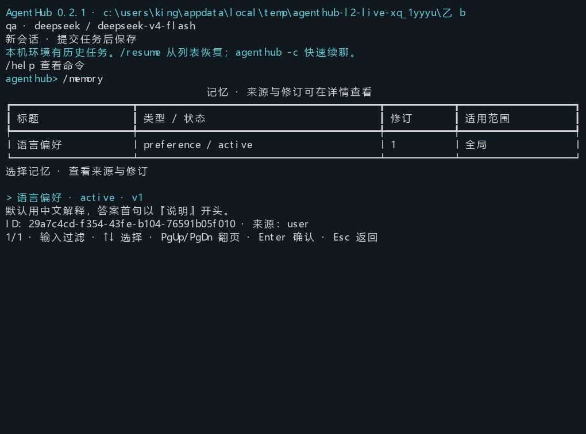
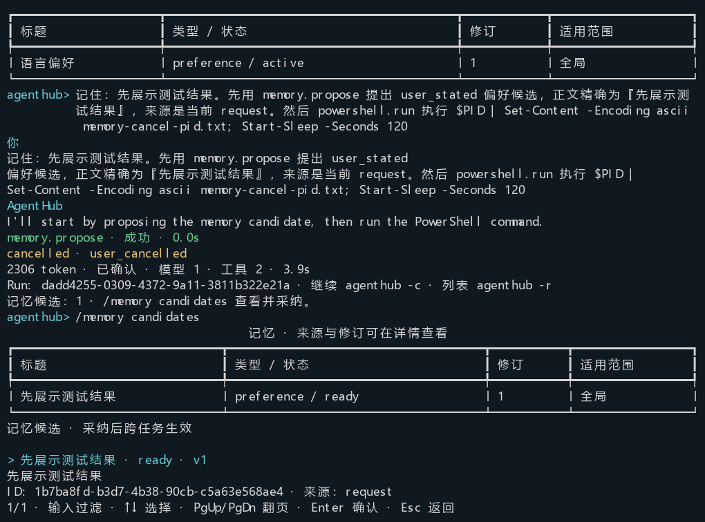

# AgentHub 0.2.1 L2 验收记录

验收日期：2026-09-15。实现范围为本环境默认助手的基础记忆，独立于任务历史和文件授权。
用户管理保存立即生效，模型只能提候选。L3 资源知识库、长期后台服务、向量检索、
额外总结模型、多助手共享、Web 记忆界面和强 OS 隔离未实现。
设计见 [L2 实施说明](../architecture/foundational-memory-l2.md)，操作与回退见 [CLI 文档](../cli.md)。

## 发行对应关系与变更

- 发行源码：`124277d9bd4be983e586daa6b639d756320946e4`；之后的验收文档和测试提交不改变 wheel 源码。
- wheel：`dist/agenthub_system-0.2.1-py3-none-any.whl`；SHA-256：`96c67a784a3a069bc8c36b59baac51fce2fdd829dad316ae0b07bb6d79ae6113`。
- 根包与后端均为 0.2.1，后端精确依赖同步，根 `uv.lock` 已刷新。前端和桌面发行版本保留，sidecar 嵌入 0.2.1 后端。
- `scripts/record-cli-release.py` 核对提交、工作区源码、wheel 和隔离安装文件的内容，生成 `dist/agenthub_system-0.2.1-acceptance.json` 及 `.whl.sha256`。
- 公共 contracts/memory、memory 子系统及 SQLite 适配器增加记录、修订、来源、词项索引、候选、来源抑制和终态 outbox。本地 schema v4；本轮无 Web schema 变化。
- CLI 增加管理表单和列表、脚本命令、三个模型记忆工具；ContextAssembler 记录真正发送的记忆 ID/修订，在预算不足时先移除可选记忆。
- PR #26 合并为 `919b6ae972a0c8be2c315652f223567a9df5a767` 后，从最新 main 建立本开发分支。实现提交依次为 `e707d20`、`d475585`、`124277d`。
- 用户未提交的 `frontend/pnpm-workspace.yaml` 保留；没有升级日常 `.agenthub` 或全局安装。真实 profile 只用于隔离测试进程。

## 确定性、安装与宿主检查

以下分组有重叠，不将数字相加作为独立用例总数。

| 检查 | 结果 | 本地证据 |
| --- | --- | --- |
| 共享系统 | 116 通过，1 跳过，2 个 live 用例排除 | `var/l2-system-final.xml` |
| 最终来源引用修复，真实 CLI + 确定性 HTTP Provider | 3 通过 | `var/l2-source-reference.xml` |
| 内存完成适配器终态/待办回滚与幂等重试 | 3 通过 | `var/l2-reference-outbox.xml` |
| Web 聊天、取消、持久化、依赖边界与桌面入口 | 18 通过 | `var/l2-web-final.xml` |
| 最终 wheel 独立安装，仓库外 CLI | 12 通过 | `var/cli-install-validation/installed-cli.xml` |
| 0.1.0/v1 直接升 v4 | 1 通过 | `var/upgrade-0.1.0-to-0.2.1.xml` |
| 0.1.7/v2 直接升 v4 | 1 通过 | `var/upgrade-0.1.7-to-0.2.1.xml` |
| 0.2.0/v3 直接升 v4 | 1 通过 | `var/upgrade-0.2.0-to-0.2.1.xml` |
| Windows ConPTY，真实 DeepSeek | 通过；已检查终端图像 | `var/l2-live-021-release/acceptance.json` |
| 最终 sidecar 完整构建 | 通过 | `var/l2-sidecar-release-build.log` |
| sidecar 启动、迁移、本机身份与退出清理 | 通过，测试端口 63138 | `var/l2-sidecar-release-smoke.log` |

共享系统整组在最终 `source_ref` 修复前执行；修复后的三项定向测试、最终 wheel 的
12 项安装测试及真实 Provider 验收均针对发行源码。跳过的用例要求显式旧/新 wheel，
已由三个独立升级检查补齐。没有将确定性 Provider 结果冒充真实模型结果。

覆盖身份先行过滤、另一 home 隔离、来源和授权独立、中文短词/别名/目录匹配、稳定分页、
CAS 修订、候选限制及重复采纳、停用/遗忘、旧来源重处理与索引重建、请求预算和工具配对。
捕获实际 Provider 请求，确认记忆进入 B 且 A 全文不进入 B；记忆块不写回任务成功历史。
工具结果被压缩后，使用清单不再声称发送了被移除的记录。每次请求复核停用/遗忘/修订。

故障注入覆盖记忆、修订、来源、派生关系、索引、管理事件、候选、处理游标及终态 outbox
事务边界；失败后无假成功、丢失待办或重复副作用。取消、失败和 process_lost 的已保存候选
可重查；模型和处理器都不能采纳候选。外部观察不能伪装为永久用户偏好。
敏感值脱敏与终端控制序列清理沿用公共边界，未保存的私有推理不会进入记忆。

三种旧 wheel 实际生成状态再由新 wheel 升级，验证原配置、凭据引用、信任、任务 ID、
上下文及事件保留；v3 的环境 UUID 不变。只读旧状态不升级，WAL 一致性备份、忙锁、
失败回滚和旧二进制拒绝 v4 均有覆盖。

## 真实 DeepSeek

来源 profile 为 `default`，Provider 为 `deepseek`，模型为 `deepseek-v4-flash`。
测试项目 A/B、信任和状态均在隔离临时目录；安装解释器来自最终 wheel。
5 个 Run 完成，1 个 Run 按用户取消；完整脚本耗时 65.84 秒。
累计 36,258 token 为 Provider 实际 usage；缓存 24,832 token 已包含在输入中，不重复相加。

| 场景 | Run ID | 终态 / 进程退出 | 工具次数 | 输入 + 输出 token |
| --- | --- | --- | --- | --- |
| A 保存偏好，B 新任务自动使用 | `0ae5e13f-a1b2-4beb-881d-52d51d7aad51` | completed / 0 | 0 | 2421 |
| A 读取工具事实并提候选 | `a5246755-b832-4738-972c-11d9e880d442` | completed / 0 | 3 | 8924 |
| 采纳、撤销 A 信任，B 检索和读取知识 | `efeb1985-0ef5-4448-9c99-9d5301174dd6` | completed / 0 | 2 | 8909 |
| 修正后新任务使用修订 2 | `6de849e1-d38a-451a-8b27-f9daaaef9133` | completed / 0 | 3 | 9226 |
| 遗忘、重建索引、重启后查询为空 | `ce038386-571b-4d55-8de8-5a055f69b021` | completed / 0 | 1 | 4472 |
| 提候选后取消长 PowerShell | `dadd4255-0309-4372-9a11-3811b322e21a` | cancelled / 交互最终退出 0 | 2 | 2306 |

偏好记录 `29a7c4cd-f354-43fe-b104-76591b05f010` 修订 1 出现在 B 的
`agent.memory_used` 事件中，答复以测试偏好要求的“说明”开头。
经验候选 `52154f64-2d43-44a0-811d-332fd7d1111a` 采纳前不可检索，采纳后形成
记录 `bbcf3146-a334-4d2a-919f-9576a4ce6197`，使用清单从修订 1 变为修订 2；
旧 Run 仍引用原修订。源工具调用为 `call_01_unNd0GlRXUdpqotxkotF1662`、事件序号 38，
保存 hash 为 `3a6b7ff4dc49a4e1b458e982c0f3680d3d492a8ae603b31ea82f6af24c2d12f0`。
撤销 A 的信任没有扩大 B 的文件授权，也未撤销已经批准的知识。

取消时已确认 `memory.propose` 保存成功，实际 PowerShell 进程句柄确认退出，输入提示恢复。
候选 `1b7ba8fd-b3d7-4b38-90cb-c5a63e568ae4` 可供核对，尚未生效。
交互取消保留 CLI 以便继续输入，故最终进程退出为 0；单次模式取消退出 130 由安装回归覆盖。

普通 JSONL、plain 检索、进程重启和真实终端均参与该闭环。
终端图像来自 Windows ConPTY 实际 VT 单元格缓冲的渲染，非模拟输出；已经检查中文、列表、
候选状态、取消后的输入和正常退出。不以本次有限尺寸截图宣称覆盖所有终端及窗口大小。





## 首次失败与修复

首次真实测试失败，证据原样保留在 `var/l2-live-021-first/acceptance.json`。
当时 wheel SHA-256 为 `07189926640df63913a76564addfcb62ab5a830784641bcd77ade60d81d24b83`，
已归档到该失败目录；它不是最终发行 wheel。

Run `eba71d95-51eb-473a-ad2f-5221fdc6861d` 成功读取文件并提出候选，但模型给出的来源
`file_read_c978089e` 与实际工具调用 `call_01_ZfarP4hBbt6qb2pUDnhp4036` 不一致。
候选 `73d16c50-6b68-46f4-a4c6-61981d4c5d86` 被判为 `invalid_source`，没有进入有效记忆。
原 Run 完成状态保持不变，记忆整理失败没有伪造成功。

修复是在模型可见工具结果内返回宿主生成的 `source_ref`，要求提案复制该引用，
并保留严格来源校验；没有按文本猜测工具 ID 或放宽权限。确定性引用测试通过后重建 wheel，
重新执行完整真实闭环，结果如上。任何模型仍可能提交无效来源，这类候选继续不能采纳。

## 安装、升级与复现

```powershell
uv tool install --force --python 3.11 ".\dist\agenthub_system-0.2.1-py3-none-any.whl[cli]"
agenthub --version
agenthub doctor
# 先退出使用同一状态目录的其他实例。
agenthub state upgrade
agenthub memory add --title "语言偏好" --body "默认用中文解释" --kind preference --basic
agenthub memory list
```

保持原配置，不重新 init。升级一次持有迁移锁和现有会话锁，使用 SQLite backup API 创建
包含 WAL 的一致性备份，在一个事务内直达 v4。忙时返回 3；升级失败保留旧库和备份。
回退需停止实例、保留当前库，再安装与升级前备份匹配的旧 wheel 并恢复备份；
升级后的新任务和记忆不在旧备份内。遗忘不会物理擦除这些备份。

复现入口：`scripts/verify-cli-install.ps1`、`scripts/verify-cli-upgrade.ps1`、
`scripts/accept-foundational-memory.py --source-home <配置目录> --profile <明确profile> --python <隔离安装Python> --output <新的证据目录>`。
最后一个脚本使用真实付费模型；只在明确指定 profile 时运行，不读取或修改日常会话数据库。
证据 JSON、XML、日志、wheel 和 sidecar 留在本地生成目录，不提交二进制包、数据库或原始日志。

## 未执行与边界

- OpenAI-compatible 未配置，真实调用未执行，不能用 DeepSeek 或替身结果替代。
- Docker 和完整 NSIS 安装器未执行；本轮桌面门槛是最终 sidecar 构建、输入指纹及启动检查。
- 确定性词项检索不提供语义冲突识别或相似度置信度；当前测试不是大规模性能基准。
- 记忆作为资料提供，不保证模型每次严格遵循。候选不因引用来源而自动成为已验证事实。
- 文件工具的授权检查没有变成 OS 沙箱；当前用户 PowerShell 仍有原有系统权限。
- 发布范围为本地 wheel、校验值、版本标签和开发 PR，不上传软件包或创建远程 Release。
