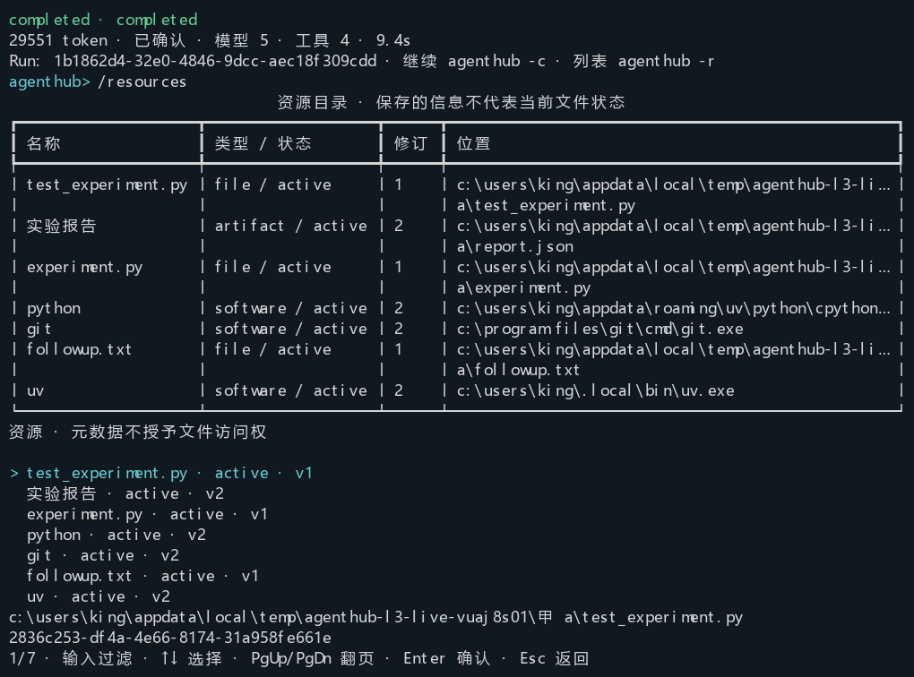
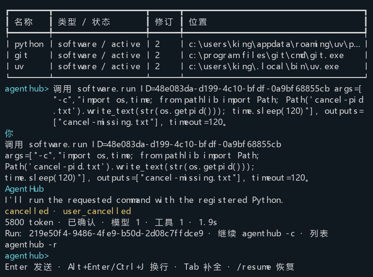

# AgentHub 0.2.2 L3 验收记录

日期：2026-09-15。交付资源目录、Python/uv/Git 软件登记与调用、任务查询和跨目录工作连续性。
客观资源事实自动登记，经验和偏好仍需采纳。当前用户进程不是 OS 沙箱；L4 继续待实现。

## 发行对应关系

- 发行源码：`9de5f6da87e95e28b740b4156b39452140192044`；后续文档提交不改 `src` 或发行元数据。
- wheel：`dist/agenthub_system-0.2.2-py3-none-any.whl`。
- SHA-256：`318e731d3ab4ee62a44ae786076d4542e2e25d5d363eda3e85a17accbdd0fdf8`。
- 共享包与后端均为 0.2.2，后端精确依赖和根锁同步；前端与桌面客户端发行版本未改变。
- `dist/agenthub_system-0.2.2-acceptance.json` 及 `.whl.sha256` 由 `scripts/record-cli-release.py` 生成；源码、wheel 和隔离安装 `.py` 文件逐一匹配。
- PR #27 已以 merge commit `7d7616663c10c26b11428a7e00f24184188b6c1c` 合入，新工作位于 `codex/resource-continuity-l3`。保留用户的 `frontend/pnpm-workspace.yaml`。

## 确定性、安装与宿主检查

| 门槛 | 实测结果 | 原始证据 |
| --- | --- | --- |
| 共享系统完整回归 | 139 通过、1 跳过；两个 live 用例不在该组执行 | `var/l3-system-final.xml` |
| 最后补充的停用验证与内存事务 | 4 通过，覆盖成功/失败/取消的两类 outbox 原子性 | `var/l3-disabled-verify.xml` |
| 独立 wheel 安装、仓库外 CLI | 13 通过；无 FastAPI/ORM/Redis/OCR/Office 依赖 | `var/cli-install-validation/installed-cli.xml`、`var/l3-install-final.log` |
| 0.1.0 / schema v1 → v5 | 1 通过 | `var/upgrade-0.1.0-to-0.2.2.xml` |
| 0.1.7 / schema v2 → v5 | 1 通过 | `var/upgrade-0.1.7-to-0.2.2.xml` |
| 0.2.0 / schema v3 → v5 | 1 通过 | `var/upgrade-0.2.0-to-0.2.2.xml` |
| 0.2.1 / schema v4 → v5 | 1 通过；记忆及遗忘状态保留，重建不复活 | `var/upgrade-0.2.1-to-0.2.2.xml` |
| Web 聊天、取消、SQL 持久化和依赖边界 | 18 通过 | `var/l3-web.xml` |
| 最终 Windows sidecar | 构建、输入指纹及启动检查通过 | `var/l3-sidecar-final-build.log`、`var/l3-sidecar-final-smoke.log` |
| Ruff、diff | 相关源码/测试/脚本检查和 `git diff --check` 通过 | 提交前检查；Ruff 采用 `--no-cache` 避免受限缓存目录 |

全量组跳过项要求显式旧/新 wheel，已由上面的四个独立升级检查覆盖。组间存在重叠，不将数量相加当作独立用例数。
升级测试由真实旧 wheel 建库，核对配置、凭据、环境和历史保留、备份版本、旧二进制拒绝新库；没有升级日常 `.agenthub`。

新增检查覆盖身份先于内容返回、路径复制与 CAS、停用和重处理、来源游标故障回滚、真实程序参数/超时、
输出缺失与未变化、元数据索引范围、WindowsApps 拒绝、任务日期与唯一候选不代选、实际请求清单、
资源预算先于历史、工具读旧任务而不转移完整历史，以及在 B 发现 A 元数据但拒绝文件验证。

## 真实 DeepSeek 与 ConPTY

最终证据目录：`var/l3-release-live/`，由 `scripts/accept-resource-continuity.py` 使用隔离安装执行。
显式 profile 为 `default / DeepSeek / deepseek-v4-flash`，运行时使用隔离配置引用；源 home 仅用于读取指定配置和凭据。
总耗时 68.31 秒，涵盖管理命令、模型任务及真实终端操作，不等同于纯模型耗时。

| Run | 任务与结果 | 终态 | 请求数 | 累计输入 / 输出 token |
| --- | --- | --- | --- | --- |
| `1ed43504-e742-4e24-a663-618b04a8fb9e` | A 修正 square、unittest、report.json、Git diff、uv、未采纳经验候选 | completed | 8 | 49005 / 1904 |
| `9f8b0f12-972c-49c0-9be5-0eab91833c76` | B 读取资源/旧任务摘要；验证 A 文件被拒绝 | completed | 3 | 16635 / 1379 |
| `1b1862d4-32e0-4846-9dcc-aec18f309cdd` | 从 B 通过列表选回 A，核实旧产物并写 followup.txt | completed | 5 | 28696 / 855 |
| `219e50f4-9486-4fe9-b50d-2d08c7ffdce9` | 登记 Python 长命令；Ctrl+C 后进程退出、恢复输入 | cancelled / user_cancelled | 1 | 5590 / 210 |
| `b2a3c644-2171-4453-8d70-6a624cb52318` | 独立 uv 夹具二进制变化，调用拒绝并返回 software_changed | completed（错误报告任务） | 2 | 7158 / 397 |

四个批任务退出 0，交互取消的 Run 为 cancelled，退出交互界面为 0；批处理取消退出码 130 由确定性安装测试覆盖。
用量由 Provider 报告，非估算；缓存输入是输入的子项，不重复计入。每请求资源/观察/任务使用清单、软件修订、实际 cwd、调用参数、退出码和工具结果保存在证据 JSON，不从检索结果推断“已发送”。

实际软件版本为 Python 3.11.15、uv 0.11.21、Git 2.55.0.windows.3。
三种软件都经过用户登记验证及 `software.run` 调用；Git diff 有差异返回 1，作为真实工具结果处理，未伪记为退出 0。
report.json 的计算结果为 9；恢复后 followup.txt 实际位于 A，B 无该文件。
移动报告后 verify 报不存在，明确 relocate 后恢复；副本保留不同资源 ID。
修改 uv 测试夹具后在启动前拒绝执行，没有更换另一程序。取消后的未完成输出没有变成成功产物。
经验候选跨任务查询无有效记忆，未被自动采纳。

下面是实际 Windows ConPTY VT 单元格捕获的渲染，不是界面设计图；已人工查看。涵盖中文、列表、窄屏、
恢复后的保存位置、取消后输入和正常退出。完整 VT 及其他图片留在本地证据目录。





## 保留的问题与修正过程

- 首次全量检查为 137 通过、1 失败、1 跳过（`var/l3-system.xml`）：新增 `/resources` 后 `/res` 不再唯一，原测试仍假定它必然补全 `/resume`。用例改为 `/resu` 和 `/reso` 分别验证两个命令，最终全量通过。
- 首次新 HTTP 测试把附有 harness 指令的请求全文拆成恰好两个 ID，夹具报错。改为只读取任务参数位置后通过；日志 `var/l3-resource-cli.log` 保留。
- 预验收中模型曾选择已有 `git.run` 而非登记软件入口，且曾传入不合法日期；保留 `var/l3-live-first/`。最终脚本逐一核实三种登记软件，最后构建的证据使用 `var/l3-release-live/`，不把预验收当成最终 wheel 的证据。
- 审阅发现停用资源的显式 verify 可能返回旧观察，已改为 `resource_disabled` 并验证；wheel、安装与 sidecar 随后重建，最终 SHA 对应修正后的源码。

## 使用、升级与边界

```powershell
uv tool install --force --python 3.11 ".\dist\agenthub_system-0.2.2-py3-none-any.whl[cli]"
agenthub state upgrade
agenthub software discover --kind python
agenthub resources search '实验'
agenthub resume --query '昨天的实验'
```

完整参数、停用/修订、软件验证、显式索引、升级及回退见[操作说明](../resources.md)。
schema v5 一次备份、单事务升级；L2 表与抑制标记保留。回退必须匹配旧 wheel 与升级前备份，
不包含升级后新增任务。已生成本地 wheel、校验值及标签 `agenthub-v0.2.2`；未上传包或创建远程 Release。

远程交付尚未完成：自动审批拒绝向公开仓库 `Haiyang-Bian/bottled-water` 推送开发分支，要求用户明确确认这个公开目的地；重新核对仓库 ADMIN 权限和 PR #27 归属后仍被拒绝。因此没有绕过限制，分支未推送、PR 未创建；完整文案已准备在本地 `var/l3-pr-body.md`。这不改变上面已通过的实现与安装验收结果。

OpenAI-compatible 没有配置，真实调用未执行。Docker、完整 NSIS 安装器未执行；桌面门槛是 sidecar 构建与启动。
不宣称大规模索引性能、语义检索、GUI 操作或 OS 隔离已通过。版本与 hash 检查不能证明软件及其所有动态依赖安全。
未知操作不自动重放；资源元数据不授予文件访问权；任意当前用户脚本依然具有该用户的 OS 权限。
