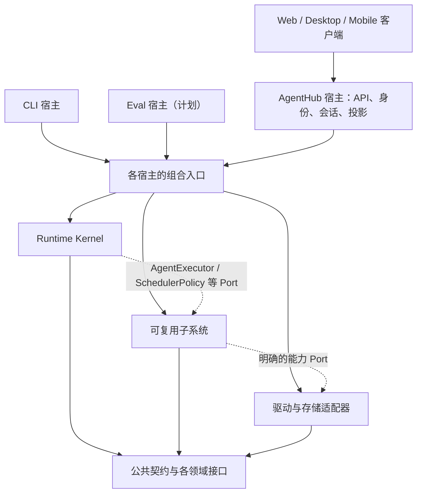

# AgentHub 系统架构：内核、子系统与宿主

> 文档状态：目标架构与 CLI MVP 迁移现状，2026-09-04。MVP 执行链已迁入根级 `src`；未迁移领域仍按原宿主实现。实测结果及剩余验收见 [CLI 实施记录](./cli-mvp.md)。

> 2026-09-15 实施增补：[本机持续记忆的智能体环境](./local-agent-environment.md)与[开发阶段](./local-agent-roadmap.md)。L1 已在 0.2.0 实现；0.2.1 的 [L2 基础记忆](./foundational-memory-l2.md)已接入本地 CLI，[验收记录](../acceptance/foundational-memory-0.2.1.md)区分通过、已修复失败和未执行项。身份、长期记忆和工作位置各自独立，保持已有 Run 生命周期。

AgentHub 的目标是成为能够被多种宿主使用的智能体执行系统。Runtime 是控制运行的内核；模型、上下文、工具、文件与进程、MCP、Skill 等是可组合的子系统；Web、命令行和评测程序负责组织这些能力并呈现结果。

拆分的目的，是让同一套智能体执行能力可以脱离 Web 会话和产品数据库运行，并能独立验证。文件总数不是完成标准：将六百个文件分到多个文件夹而保留原来的依赖链，不能解决问题。

## 1. 文档结构与效力

| 文档 | 回答的问题 | 性质 |
| --- | --- | --- |
| 本文 | 整个系统如何分层，谁拥有状态，宿主如何组装系统 | 目标设计 |
| [子系统与模块目录](./subsystems.md) | 每个子系统包含什么模块、提供什么能力、当前代码在哪里 | 目标职责与现状映射 |
| [新旧架构差异与迁移](./migration.md) | 旧结构有什么问题，如何逐步拆分，怎样判断拆分有效 | 源码证据、迁移计划与验收标准 |
| [本机持续记忆设计](./local-agent-environment.md) | 智能体如何跨目录、任务和软件连续工作，记忆与权限如何分工 | L1 已实现，其余为目标设计 |
| [本机环境开发阶段](./local-agent-roadmap.md) | L1–L4 怎样增量交付、迁移、验证及判定不能放行 | L1/L2 验收入口，L3–L4 开发计划 |
| [L1 0.2.0 实施计划](./local-environment-l1.md) | 本轮如何分阶段实现身份、迁移、位置和全局任务入口 | 已实施，验收记录分别列出通过及限制 |
| [L2 0.2.1 基础记忆](./foundational-memory-l2.md) | 知识保存、采纳、检索、修正、遗忘及 schema v4 | 已实施，独立于任务历史和文件授权 |
| [Backend architecture](../backend-architecture.md) | 当前 FastAPI 后端的真实组织方式 | 当前实现说明 |
| [Runtime 架构](../runtime/architecture.md)与[不变量](../runtime/invariants.md) | 生命周期、调度权限、Journal、协作和隔离的精确语义 | 内核契约 |
| [Runtime 当前实现](../runtime/current-state.md)与[项目状态](../implementation-status.md) | 哪些契约已经实现，哪些还存在差距 | 当前状态 |
| [File map](../file-map.md) | 现在去哪里修改代码 | 当前路径索引 |

本文扩展原来的 Runtime 分层，不废除已有运行时不变量。描述现状时以源码和对应测试为准；描述目标时以本目录与 Runtime 契约为准。出现冲突必须明确修订契约，不能借移动模块改变终态、隐私或授权语义。本次按已批准的 M0–M4 计划分阶段实施；超出 MVP 的拆分继续单独评审。

## 2. 操作系统类比及其边界

| 操作系统视角 | 本项目对应对象 | 应采用的边界 |
| --- | --- | --- |
| 内核 | `RuntimeEngine`、`RunKernel`、Watchdog | 管生命周期、资源额度、控制事件和状态提交 |
| 进程 | 一次 `Run` | 独立 ID、预算、事件序列和唯一终态；不是 OS 进程 |
| 任务与通信 | `AgentActor`、Mailbox、团队消息 | 协作式执行，显式共享消息；不是线程级或硬件级隔离 |
| 系统服务 | 模型、上下文、工具、MCP、Skill、工作空间等 | 提供可复用能力，通过公开契约协作 |
| 驱动 | Provider SDK、文件/进程、数据库、凭据实现 | 适配外部环境，不能取得内核终态控制权 |
| Shell | 本地 CLI | 组装本地能力、输入命令、显示事件和运行结果 |
| 图形应用 | AgentHub Web 与桌面工作台 | 处理产品身份、会话、界面、读模型和发布流程 |
| 系统测试程序 | 计划中的 eval harness | 通过公共接口验证同一套内核及子系统 |

这是软件职责模型，不是重新实现操作系统。不要求微服务、多仓库或 RPC；初期优先保持单进程、monorepo 和进程内调用。Python 模块边界不等于安全沙箱，工作树隔离也不等于操作系统权限隔离。阻塞代码的强制终止仍需明确的子进程或容器实现。

## 3. 全局分层



实线表示客户端访问、组装或依赖关系；虚线表示通过接口调用。Kernel 调用的是注入的 Port，不导入具体子系统实现；驱动实现接口，也不反向调用宿主业务。

| 层 | 内容 | 不应承载 |
| --- | --- | --- |
| C：契约 | 稳定 ID、请求/结果、能力描述、领域错误、必要的 Port | ORM、Web 请求对象、自动读取应用配置、SDK 实例 |
| K：内核 | Run、Actor、Mailbox、Watchdog、租约、Context CAS 提交协调、事件序号与终态 | 默认 AgentLoop、HTML/部署判断、用户 RBAC、模型厂商细节 |
| S：子系统 | 执行、调度策略、模型访问、上下文、工具、工作空间、MCP、Skill、Workflow、内容、外部 Agent、记录消费 | AgentHub 会话表、路由、UI 卡片、产品默认值 |
| D：驱动与适配器 | SDK、文件/进程/Git、SQLite/SQLAlchemy、凭据、协议传输 | 自行改变授权、捏造结果、提交 Run 终态 |
| H：宿主与应用扩展 | Web/CLI/eval 组合入口、产品数据映射、权限来源、展示与产品策略 | 第二套 Run 状态机、第二套通用工具或 AgentLoop |

契约按领域归属维护，不建立容纳全部服务的 `common` 大包。公共 AgentLoop 与 CLI 工具基础设施已经迁入 `agent_subsystems`；`agent_runtime` 仍有待收敛的团队/Workflow 等旧内部模块。详情见[模块目录](./subsystems.md)。

## 4. 依赖规则

1. 内核仅依赖轻量契约及必要的基础库。模型厂商、HTTP 框架、产品数据库和文档渲染库不能成为 Kernel 的导入前置条件。
2. 子系统不得导入 `app`、`db`、FastAPI request 或 AgentHub ORM。它们接收通用规格、能力授权和明确注入的依赖；禁止通过全局变量重新访问宿主。
3. 子系统之间允许依赖必要的公开接口。例如执行子系统调用模型和工具接口，Workflow 节点调用 `ToolInvoker`。禁止跨子系统引用私有实现或传递数据库 Session。
4. 具体驱动由宿主创建并注入。Provider SDK、OCR、Office 转换等按所选能力加载；没有安装某个可选依赖时，只使对应能力不可用。
5. 产品扩展可以调用公共子系统；子系统不识别产品扩展名称。全栈任务顺序、Daily Chat 默认 Agent、产物卡片和部署交付启发式属于 AgentHub。
6. 工具调用 Skill、Skill 调用工具时，通过注册表和注入的调用接口连接。不得形成 `tools.executor -> skills.runtime -> tools.executor` 的实现导入环。
7. CLI 与 eval 使用和 Web 相同的通用实现。CLI 不能只转发到 Web API 来证明独立性，也不能复制 AgentLoop 来绕开现有耦合。

后续依赖检查应同时覆盖直接导入、传递导入和最小安装环境。现有 AST 禁止 `agent_runtime -> app/db` 的测试是第一道约束，尚不足以证明完整系统可独立安装运行。

## 5. 公共契约

### 已有契约继续作为起点

现有定义见 [`core/ports.py`](../../src/agent_runtime/core/ports.py)、[`run_types.py`](../../src/agent_runtime/core/run_types.py)和[公共导出](../../src/agent_runtime/__init__.py)。

| 契约 | 作用 | 所有权 |
| --- | --- | --- |
| `RunRequest`、`RunResult`、`RunHandle` | 提交、观察、取消一次运行 | 内核公开 API |
| `AgentExecutor` | 执行一次 Agent 工作，返回输出、状态报告、用量与记忆增量 | 内核定义需求，执行子系统实现 |
| `SchedulerPolicy` | 从快照产生调度提案 | 内核定义需求，策略子系统或宿主扩展实现 |
| `ContextStore` | 加载 Scope 快照，以预期版本提交增量 | 内核协调提交，存储适配器实现 |
| `RunJournal`、`TeamJournal` | 运行事件和团队消息的持久一致性 | 内核定义原子性，存储适配器实现 |
| `RunEventSink` | 接收已提交事件 | 可观测性子系统或宿主投影实现 |
| `TeamMessenger`、`ExecutionRootPort` | 显式团队通信和可信执行根解析 | 内核控制权限，具体资源由宿主绑定 |

### 待收敛的跨子系统契约

下表描述跨子系统职责。MVP 已在 `agent_contracts/execution.py` 实现 `ExecutionContext`、`WorkspaceSpec`、`ToolSpec` / `ToolInvoker` 等最小接口，其余仍为设计用语；实际可导入内容以源码为准。后续先检查现有接口能否增量演进，避免并存两套同义类型。本机环境新增的记忆和位置契约见[详细设计](./local-agent-environment.md)。

| 拟定契约 | 最小内容 | 不能包含 |
| --- | --- | --- |
| `ExecutionContext` | run/scope/agent 标识、有效授权、可信执行根引用、deadline、取消与租约约束 | `User`、`Conversation`、Session、任意服务定位器 |
| `ModelSpec` / 模型调用接口 | 模型标识、能力、消息、工具 schema、输出限制、流片段和 usage | 前端 Provider 表单结构、明文密钥持久值 |
| `ToolSpec` / `ToolInvoker` | 名称、schema、能力需求、执行及标准结果 | HTTP response、ORM Invocation、产品默认全权限 |
| `ContextContributor` | 显式来源、可见范围、内容片段、优先级和预算信息 | 自动扫描无关会话、无上限注入原始日志 |
| `SkillSpec`、`McpServerSpec` | 包/版本/入口/依赖或传输配置，凭据引用 | Skill/McpServer 数据库实例 |
| `WorkspaceSpec` / 资源接口 | 可信根、文件/进程/worktree 句柄、授权后的资源操作 | 模型指定的任意宿主路径权力 |
| `ContentRef` / `OperationResult` | 内容类型、资源引用、状态、原因、用量或证据引用 | 固定 `/api` 下载 URL、卡片格式、把降级当成功 |

`ExecutionContext` 是受控数据上下文，不是新的大服务容器。模型、工具、存储和审计接口通过构造参数显式注入；按调用传递的上下文只表达本次执行的身份、资源与限制。契约应提供序列化版本、稳定错误码和必要的能力发现；插件或驱动不支持某能力时明确报告。

## 6. 状态所有权与一致性

| 状态 | 唯一权威 | 其他层如何访问 |
| --- | --- | --- |
| Run 状态、预算、Actor 控制和唯一终态 | Kernel；终态由 Journal 原子持久化 | Policy 提案、Executor 结果、Handle 查询；宿主不能自行补成功 |
| 有序运行事件 | `RunJournal` | Sink、Web、CLI、eval 通过游标消费；投影不是第二真源 |
| 团队消息、收件人和线程状态 | Kernel 协作协议 + `TeamJournal` | 团队工具经 `TeamMessenger` 提交；私有上下文不自动广播 |
| Scope 消息、Blackboard、结构化 AgentMemory | `ContextStore` | 上下文子系统读取快照，Executor 返回增量，Kernel 协调 CAS |
| 跨任务长期记忆及其修订 | 公共 memory 子系统与 SQLiteMemory | 上下文子系统按授权读取并记录使用清单；不共享全局 Context scope |
| 本机工作位置；资源目录待实现 | workspaces 与持久化适配器 | 宿主/工具通过受控接口更新；位置不代表授权，旧 Run 保留当时位置 |
| 工具/MCP/Skill 调用记录 | 相应子系统的调用生命周期与 Record Port | 存储驱动落盘，记录通过 run/call ID 关联 Journal；不宣称跨所有存储的统一事务 |
| 进程和终端活句柄 | 资源子系统/具体进程驱动 | 持有者负责关闭；数据库记录不能重建仍活着的进程 |
| Workflow 节点状态 | Workflow 子系统 | 转换为执行请求和结果；不能独立提交父 Run 终态 |
| User、Conversation、Task、Artifact 发布记录 | AgentHub 宿主 | 转换成通用输入、资源引用及读模型，不传入共享 API |
| 凭据内容 | 宿主指定的凭据存储与最末端驱动 | 子系统使用引用；模型文本、日志和公共事件不得携带密钥 |

Journal 内部的追加、终态 CAS、团队消息与事件原子性必须保留。外部工具副作用与数据库事务不天然原子：迁移时为每次调用保留稳定 ID、能力级重试规则和不确定结果，不能因为网络重试就重复执行文件写入或外部操作。

三种行为必须区分：事件重放是重建观察结果；同一 Scope 的下一 Run 是使用已提交上下文开始新请求；崩溃续跑需要安全检查点和外部操作恢复协议。目前第三种未实现，继续采用 `failed/process_lost`。

新方向允许获准的长期知识跨 scope 检索，仍禁止隐式拼接其他任务或助手的私有历史。成功任务与记忆整理通过可恢复的待处理记录连接；记忆整理失败不改写已提交的成功终态，来源事实和处理游标必须可追踪。详见[记忆一致性设计](./local-agent-environment.md)。

## 7. 一次运行如何经过各层

1. 宿主处理用户输入与身份，读取本地配置或产品数据，产生通用 Agent/模型/工具规格，绑定 Scope、有效授权和执行根。
2. 组合入口创建所需驱动、子系统和策略，注入 `RuntimeEngine`。未启用的能力不应启动服务或加载重量依赖。
3. Kernel 加载 Scope、创建 Run 和 Journal，验证策略提案后驱动 Actor。
4. Actor 调用 `AgentExecutor`。执行子系统通过上下文装配器构建模型输入、调用模型、解释工具调用、经工具子系统执行并汇总结果。
5. 工具子系统校验授权/schema/资源边界，再派发文件、终端、MCP、Skill、内容或外部 Agent。嵌套调用继承并可收窄授权与预算，不能放大权限。
6. Executor 在取消与租约边界内报告用量、进展、输出和记忆增量；只有 Kernel 能决定后续调度、提交 Context 和终态。
7. Journal 先提交事件，Web 投影、CLI 输出和 eval 记录随后消费。各宿主可以不同展示，但不能改变已提交事实。

资源生命周期统一为“创建方负责关闭”。一次 Run 的临时资源随 Run 收敛；跨 Run 的 Provider 连接、存储连接与 MCP 连接池由宿主关闭；工作树和用户文件的保留由显式资源策略决定，取消 Run 不等于删除文件。

## 8. 宿主与发行方式

| 宿主/客户端 | 目标职责 | 当前状态 |
| --- | --- | --- |
| AgentHub Web 后端 | 身份/RBAC、产品数据映射、服务组装、API/SSE/WS、投影与发布 | 已存在；通用能力仍大量混在 `app/services` |
| React 工作台 | 对话、工作流画布、权限配置、运行观察、产物展示 | 已存在；消费 Web 协议，不直接导入 Python Kernel |
| Tauri 桌面端 | 启动/打包本地后端、单用户身份、桌面系统集成 | 已存在；目前仍宿主完整后端，不代表已拥有独立轻量运行时发行包 |
| Mobile/PWA/Capacitor | 移动输入、展示和连接同一后端 | 已存在；不是另一个 Python 执行内核 |
| 本地 CLI | 配置、本地 Scope、命令/交互输入、文本或 JSONL 事件、取消、退出码 | 已实现于 `src/agent_cli`；`app.cli` 仍只管理 Web 管理员初始化 |
| Eval harness | 固定输入、依赖替身、故障注入、真实模型任务和可复现报告 | 待实现为独立宿主；已有 pytest 是重要基线 |

首个 CLI 版本包含交互 REPL、单次运行、持久会话、事件观察和取消；团队工作树及多能力组合以后逐项加入。它类似编码 Agent 的终端入口，但价值在于验证本项目的执行系统，不以复刻其他产品界面作为验收标准。

CLI 的 stdout 在 JSONL 模式仅承载机器可读结果/事件；日志与交互提示走 stderr。区分 Run 成功、失败、取消、配置错误与缺失能力；退出码为成功 0、运行失败 1、配置/能力/信任错误 2、会话占用 3、取消 130。`replay` 只读取已保存事件，不承诺恢复进程。评测明确区分确定性替身与真实 Provider，禁止用 mock/fallback 结果计入真实成功率。

## 9. 建议的源码组织

下面目录已建立。根级发行包 `agenthub-system` 包含共享系统及 CLI；`agenthub-backend` 依赖它并保留 Web 依赖。根级 uv workspace 共用一份锁文件，独立 wheel 安装验证实际依赖隔离。MCP、Skill、Workflow、内容和外部 Agent 的新目录目前只有职责说明。

```text
src/
  agent_contracts/       少量跨领域值类型、授权与资源引用
  agent_runtime/         Kernel 与其公开生命周期 Port
  agent_subsystems/
    execution/           默认 AgentLoop / AgentExecutor
    scheduling/          通用单 Agent、团队与工作流调度策略
    context/             上下文装配、记忆与检索接口
    tools/               目录、授权执行、调用结果与注册表
    workspaces/          文件、进程、终端、工作树资源服务
    mcp/                 服务发现、调用、连接生命周期
    skills/              包、版本、依赖、运行器
    workflow/            图定义、验证、执行、节点
    content/             文档模型、提取、转换、渲染
    external_agents/     外部 Agent 会话和事件适配
    observability/       Journal 消费、脱敏、记录和导出
  model_provider/        模型接口、能力与可选 Provider 驱动
  agent_adapters/        通用本机资源、存储、凭据实现
  agent_cli/             本地宿主与命令入口
backend/src/
  app/                   AgentHub API、组合入口、业务与产品适配器
  db/                    AgentHub 专属模型与迁移
```

`agent_subsystems` 只是领域命名空间，不得新建一个全能调度中心。传输和驱动可以紧邻对应子系统放置，但必须可选加载，并遵守相同依赖规则。现有 `model_provider` 优先演进；迁移同时更新宿主与测试的导入，删除旧实现和旧导出，不保留兼容别名。尚未迁移的团队/Workflow 策略仍暂存 `agent_runtime`；这不代表其最终归属为 Kernel。

## 10. 本机持续记忆方向（L1/L2 已实现，L3/L4 待实现）

智能体身份与基础记忆归属于用户的本机环境；任务拥有独立历史和运行状态；工作目录是可变的执行位置与资料线索。项目可以关联多处资料和软件，不再作为智能体本身的容器。

按 L1 任务/位置解耦、L2 基础记忆、L3 资源与软件连续性、L4 共享与细粒度执行推进。先服务一个持续助手，沿用现有单 Agent 执行链；多助手不要求复制记忆实现或另起 Runtime。详细行为、拟定接口与现状差异以[设计文档](./local-agent-environment.md)为准，阶段状态和证据入口以[开发计划](./local-agent-roadmap.md)为准。

是否成功拆分，由独立安装、Web/CLI 共用执行链、故障与授权契约测试、事件与上下文一致性来判断。具体步骤见[迁移与验收](./migration.md)。
