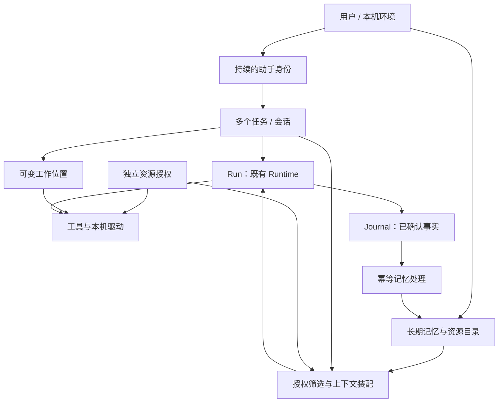

# 本机持续记忆的智能体工作环境

> 状态：0.2.0 已实现 L1 本机身份、全局任务恢复与工作位置解耦；L2–L4 待实现。验收见[0.2.0 记录](../acceptance/local-environment-0.2.0.md)。
> 源码核对基线：`d43f07ba954b74ea544815f4ba8a294766109f34`，共享包版本 `0.1.7`。
> 本文记录用户确认的产品方向，并提出可实施的默认行为与技术设计；不代表功能验收通过。开发顺序及放行条件见[开发阶段](./local-agent-roadmap.md)。

## 1. 方向与目标

AgentHub 面向用户提供一个持续存在的本机智能体工作环境。智能体能够跨目录、跨会话和跨软件保留基础知识，并根据任务找回相关工作。工作目录用于相对路径解析、程序执行和资料定位，不再作为智能体身份或长期记忆的硬边界。

这里的“整台电脑的总体记忆”指**某个用户在这台电脑上的智能体环境**。它不等于向所有 Windows 用户共享资料，也不意味着启动时扫描整块磁盘、自动获得所有文件权限或把全部历史放进模型。

### 1.1 已确定的方向

- 智能体身份和基础记忆独立于启动目录；切换位置不导致失忆。
- 一项任务可以涉及多个目录和软件，项目是组织资料与工作的视图。
- 基础记忆先服务一个持续的助手，后续可以授权多个助手共享。
- 工作目录、记忆可见性、资源授权分别建模；目录关联本身不授予权限。
- 保留细粒度权限方向，但先解决任务连续性与基础记忆，不以多智能体审批体系为前置。
- 延续“契约—内核—子系统—驱动—宿主”，复用既有 Runtime、AgentLoop、Journal 和持久化能力。

### 1.2 首要用户场景

第一天，用户在代码目录执行实验，形成结果并留下一个未完成问题。第二天，用户从资料目录启动 AgentHub，说“继续昨天的实验，按我常用的方式画图”。助手应能：

1. 识别正确的旧任务；有多个候选时提供可读列表。
2. 找回已保存的进展、用户偏好、结果位置和软件使用记录。
3. 核实易变化信息，例如文件是否存在、软件是否仍可用。
4. 在已授权范围内选择工作位置和工具，完成后续操作。
5. 保留新结果和来源，使下一次继续工作仍有可靠依据。

不要求用户记住会话 ID、先进入某个精确路径，或重新介绍整项工作。

### 1.3 本方向不承诺的能力

全盘自动理解、无界长期上下文、无误的自动总结、任意软件自动操控、跨设备同步、进程崩溃原地续跑、自动重放副作用均不属于首个交付闭环。跨软件首先指已接入的命令或工具；专业软件界面自动化仍需相应适配器。Windows 原生强隔离另设实际验收，不能由产品模型或 Python 接口代替。

## 2. 当前实现与目标的差别

下表保留 0.1.7 的历史基线对照。L1 中的身份、会话恢复与位置已在 0.2.0 实现；长期记忆、资源知识库及强隔离仍是目标，当前命令以 [CLI 说明](../cli.md)为准。

| 方面 | 0.1.7 基线 | 本方向目标 |
| --- | --- | --- |
| 会话恢复 | `SessionCatalogReader.resolve` 拒绝目录不匹配；普通列表按目录筛选 | 会话属于用户的本机环境，目录是筛选与排序线索 |
| 默认继续 | 当前目录最近有 Run 的会话 | 本机环境最近有 Run 的获准会话，显示并恢复其保存位置 |
| 工作位置 | `WorkspaceSpec.root` 同时参与路径解析与资源范围 | `ExecutionLocation` 表达位置；`ResourceGrant` 独立表达授权 |
| 身份 | CLI 组装 `AgentConfig("local", ...)` | 稳定的本机环境及助手身份，不用 cwd 或显示名称代替 |
| 记忆 | `ContextSnapshot.agent_memories` 随 scope 保存 | 任务 scope 保留，另设跨 scope 的长期记忆存储 |
| 上下文 | `LocalContextProvider` 读取当前快照和目录说明 | 加入有来源、受预算约束的长期记忆与任务检索 |
| 事实来源 | Run、事件、结果、失败续接已持久化 | 复用为记忆来源，不复制一套操作历史 |
| 一致性 | `RunCompletionPort` 原子提交成功上下文、续接游标、结果和终态事件 | 保留原事务；以可恢复的记忆处理任务连接长期记忆 |
| 权限 | 文件/cwd 校验与目录信任；命令使用当前用户，无 OS 文件/网络隔离 | 逐步拆分动作与资源，并由驱动声明实际强制能力 |

源码入口：

- [会话控制与恢复](../../src/agent_cli/sessions.py)、[CLI 组装](../../src/agent_cli/host.py)。
- [执行与资源契约](../../src/agent_contracts/execution.py)、[本机进程驱动](../../src/agent_adapters/local/processes.py)。
- [ContextSnapshot / AgentMemory](../../src/agent_runtime/core/run_types.py)、[Scope 存储](../../src/agent_runtime/context/scope_store.py)。
- [上下文提供器](../../src/agent_subsystems/context/local.py)、[上下文预算](../../src/agent_subsystems/context/assembler.py)。
- [完成提交契约](../../src/agent_contracts/persistence.py)、[SQLite 实现](../../src/agent_adapters/storage/sqlite.py)。

## 3. 核心对象与身份

下列名称覆盖完整目标。`LocalEnvironment`、`ExecutionLocation`、Task/Session、Run 和 `ResourceGrant` 已有 L1 实现；`ResourceRef` 与 `MemoryRecord` 尚未实现。默认助手身份使用 environment_id + local，未引入多助手目录。

| 对象 | 职责与身份 | 生命周期 |
| --- | --- | --- |
| `LocalEnvironment` | 用户在本机的一套配置、基础记忆和资源目录；有稳定 `environment_id` 与拥有者 | 跨启动、跨任务；与 `AGENTHUB_HOME` 数据边界对应 |
| `AgentIdentity` | 稳定 `agent_id`、拥有者、职责及可使用的记忆范围 | 跨目录、跨会话；模型/profile 更换不自动改变身份 |
| Task / Session | 目标、请求与答复、进展、阻碍、最近工作位置 | 首版沿用现有 session ID 作为任务入口，避免再造一套同义对象 |
| Run | 一次用户输入引发的执行，有预算、事件序列和唯一终态 | 沿用既有 Kernel 语义 |
| `ExecutionLocation` | 默认 cwd、可选关联资源及位置版本 | 可在任务内变化；每次调用记录位置快照 |
| `ResourceRef` | 项目、数据、产物、目录或软件的逻辑身份及定位信息 | 位置可变化；原始操作记录不随之改写 |
| `ResourceGrant` | 对资源可进行哪些动作及其有效期、来源 | 独立于 cwd 和记忆相关性 |
| `MemoryRecord` | 有来源、有适用条件、可修正的长期知识 | 独立版本、有效状态和共享范围 |

首版只创建一个默认助手，不需要用户管理一套复杂的身份目录。安装目录路径和 Windows 账户名都不宜成为持久身份的唯一标识。复制状态目录到其他机器时需显式导入或重新绑定环境，不能直接把旧机器路径和执行授权当作新机器的事实。

这不是微服务拓扑。初期仍可由 CLI 在单进程中组装各服务，状态保存在 SQLite；不要求常驻服务。

## 4. 状态与记忆分层

### 4.1 各层职责

| 层 | 内容 | 是否跨任务 | 权威来源 |
| --- | --- | --- | --- |
| 基础资料 | 用户明确偏好、少量必要约定、环境概况 | 是 | 用户输入和已验证环境记录 |
| 长期工作知识 | 项目用途、资源关系、决定、经验证经验 | 按授权共享 | 有来源的记忆记录 |
| 任务状态 | 当前目标、进展、阻碍、待核实操作 | 通过显式查询或恢复 | 当前会话与 Journal |
| 会话历史 | 原始请求与答复 | 可授权查询，不整批混入新会话 | 会话与 Run 历史 |
| 操作证据 | 工具参数、结果、退出码、文件 hash | 按记录权限查询 | Journal / 现有结果记录 |
| 模型上下文 | 本轮实际需要的上述材料 | 临时装配 | 带来源清单的输入快照 |

`ContextStore` 继续保存独立任务快照。长期 `MemoryStore` 不通过把所有任务的 scope 改为全局来实现；会话锁、Context CAS 和失败续接仍按任务工作。

基础资料应小而稳定。项目事实可以全局检索，但其来源和适用范围仍然明确；一项任务的临时要求不能自动成为全局偏好。

### 4.2 最小记录结构

| 字段组 | 建议内容 |
| --- | --- |
| 标识 | memory ID、修订号、environment/owner、作者 agent |
| 内容 | 类型、主题/实体、简明陈述、适用条件、可选标签 |
| 来源 | 用户声明，或 source Run ID + 事件序号 + 调用 ID，或资源 ID + 文件版本/hash |
| 可信状态 | `user_stated`、`observed`、`inferred`；与是否当前有效分开 |
| 生命周期 | 创建时间、最近验证时间、有效期或再验证条件、active/superseded/disputed/forgotten |
| 关联 | 被替代的修订、原始任务、相关资源、可读取的证据引用 |
| 可见性 | 拥有者、允许的助手/共享域、来源限制及允许复用范围 |

不以模型自报的数值置信度作为授权或事实成立依据。推断可以被保存，但必须能与用户声明和工具观察区分。

### 4.3 修正、过期与冲突

- 用户更改长期偏好时，新版本替代旧版本，旧任务保留当时使用的版本引用。
- 软件位置、分支、文件状态等易变化事实，在执行前核实；记忆提供定位线索，不能替代现场检查。
- 两条记录冲突时标记争议，并提供来源；较新的时间戳不自动使事实成立。
- 只有同一事实、同一适用范围的更新才互相替代，避免把项目 A 的设置覆盖到项目 B。
- 记忆变多时优先降低无关、重复和过期资料的召回，而非删除原始操作事实来维持表面简洁。

## 5. 记忆写入与一致性

### 5.1 写入来源

1. **用户明确要求记住：** 经宿主身份与可见性检查后保存用户声明；返回保存结果，不能只口头承诺。
2. **真实工具观察：** 由已持久事件派生环境、资源与操作事实；失败 Run 中已经完成的工具操作仍可作为事实。
3. **模型总结或推断：** 产生结构化候选及来源引用，由记忆子系统校验、去重和按策略采纳；不能直接覆盖用户约定。

普通类别可以由预设策略自动保存，UI 提供简洁变更摘要和撤销入口，不逐条打断。敏感信息的保存/复用策略单独配置。私有推理、凭据原文以及工具中的终端控制文本不得成为长期记忆。

记忆工具只接受内容、来源等允许字段；owner、环境、有效权限和策略来源从可信执行上下文绑定，不能由模型伪造。来自 README、网页或工具输出的指令仍是外部数据，不能自动升级为系统规则或永久用户偏好。

### 5.2 与 Run 完成事务的关系

保留 `RunCompletionPort` 的成功原子性：Context CAS、续接游标、Run 结果和终态事件一起提交。需要从成功任务提炼记忆时，在同一事务中登记轻量的待处理任务（outbox）；不在数据库事务内请求模型或构建大型索引。

失败、取消和 `process_lost` 的已提交事件也可登记/发现待处理事实，但不能因此写入成功上下文或改写失败终态。未知操作仍标记未知，harness 不自动重放其副作用。

处理步骤为：读取已提交来源 → 校验候选与当前策略 → 写记忆修订及处理游标 → 更新可重建索引。采用稳定来源键和修订检查，重复启动或重试不重复生成同一条记忆。首版可在下一次启动或任务空闲时处理有界队列，无需后台常驻进程。

- outbox 登记失败时，所属完成事务整体回滚，沿用现有持久化失败语义。
- 任务已成功、后续整理失败时，保留成功终态，显示记忆处理待完成并可重试。
- 用户直接执行记忆管理操作时，按独立管理事务处理；写入失败必须明确告知，不能显示“已记住”。
- 模型工具产生的候选应在运行中持久化；取消后可以核对已有候选，不能等待一个不会再出现的最终答复。

### 5.3 不默认增加模型调用

首版使用结构化写入、事件提取和当前 AgentLoop 内的有来源候选。额外模型整理、embedding 或重排需要独立能力配置、费用/时间预算和记录；不能因开启记忆就隐式不断消耗模型额度。

### 5.4 修正与遗忘

提供查看、修正、停用、遗忘及其结果查询。遗忘需覆盖可召回记录和派生索引，并登记阻止从旧来源再次自动生成的标记。用户再次明确提供新事实时，可通过显式操作建立新记录。

逻辑遗忘与物理删除历史分开：保留 Run 日志时，应说明它仍可由获准历史查看入口读取，但不再自动用于记忆召回或再生成。完整删除需说明原日志、备份和外部已发送数据各自边界；不能承诺撤回已经发送给模型或导出的内容。存储备份的保留与清理另有明确策略。

## 6. 记忆读取与上下文预算

### 6.1 读取流程

当前请求与任务状态 → 身份和可见性筛选 → 候选检索 → 适用性、有效性与来源检查 → 去重与预算排序 → 上下文装配。

先限制可见记录，再返回检索结果；条数、标题和摘要也不能泄露未授权内容。目录可以提高相关性，不构成唯一召回条件。项目关系、别名、任务标题、时间和软件名称同样参与检索。

每次新用户请求自动进行有界检索。运行中新增资源或任务转向时，可以通过记忆查询工具按需补充；不要求每轮模型请求都重新搜索全部记忆。`ContextAssembler` 仍对每次最终模型输入执行预算检查。

### 6.2 内容与预算

- 固定注入少量基础资料，其他工作知识按需读取。
- 记忆有独立大小上限，同时计入现有总上下文预算；不能挤掉当前用户请求或破坏工具调用/结果配对。
- 可从基础资料约 2,000 字符、检索片段约 8,000 字符的可配置上限起步，经相同任务实验再调整；这些是建议初值，不是 token 数、模型窗口或性能承诺。
- 文件/工具输出保留引用，不把原始日志复制成多份长期记忆。按现有结果读取能力获取完整证据，实际保存时已截断的内容仍标为不完整。
- 窗口未知、usage 估算等现有标记继续保留；额外整理费用单列。

### 6.3 读取清单和降级

每个 Run 记录实际使用的 memory ID、修订、来源引用、查询/装配大小及裁剪原因。记录采用可说明的匹配字段，不保存模型私有推理。新修订只影响之后的读取，不能回写已经发出的模型请求。

没有可靠匹配时返回无结果；多个相似任务时展示候选。可选记忆检索故障可明确降级为当前任务工作，不能声称已参考历史；若用户任务本身是“找回/保存这条记忆”，失败不能伪装成完成。授权检查故障不可降级为放行。

## 7. 本机资源目录与软件使用

### 7.1 资源目录的范围

首版登记项目、资料集、常用目录、产物和可调用软件。资源拥有逻辑 ID、名称/别名、类型、当前位置、验证时间、来源和关联。项目是其中一种资源，不是智能体的容器。

登记来源包括用户指定、实际任务访问和显式限定范围的索引。未访问位置可以保持未知；“全局”表示可关联已知信息，不代表遍历全部文件。

### 7.2 位置变化

路径变化更新资源定位，新旧任务保留各自的事实。内容 hash、文件系统标识等只能辅助判断；相同内容可能是复制，不能据此无条件合并。路径失效、同名多份、链接目标变化时先核实，不凭旧记忆修改一个猜测出来的替代文件。

文件工具继续处理真实路径、中文、空格和链接目标。命令的 cwd 是执行参数，授权目录是另外的数据；二者不能再由单个 root 字段同时解释。

### 7.3 软件记录

记录程序标识、已验证的可执行路径、版本、支持的任务类型、参数模板、输入输出位置和必要的环境配置引用。使用前核实存在与版本变化，凭据只保留引用。

软件操作经验不等于可自动执行的可信脚本。外部文档中的命令仍需经过工具和授权入口；软件适配器负责实际调用，记忆子系统负责提供已知用法和来源。

## 8. CLI 目标行为

以下设计中的全局恢复与工作位置已由 0.2.0 固化为 CLI 行为，明确增加 `--here`、`--cwd`、`/cd`、`history` 和 `state upgrade`。涉及记忆的入口仍待 L2，不能据此调用尚不存在的命令。

| 入口 | 目标行为 |
| --- | --- |
| `agenthub` | 新任务草稿；加载基础记忆；启动目录作为初始工作位置 |
| `agenthub -c` | 恢复当前本机环境最近有 Run 的获准任务；排序继续依据 Run 活动；被占用则报告，不换另一个 |
| `agenthub -r` / `/resume` | 全部获准任务的可读选择器；可按目录、主题筛选；完整 ID 仍用于诊断与脚本 |
| 显式 resume ID | 按环境/拥有者核实任务；不再单因启动目录不同拒绝 |
| `/new` | 新任务草稿，保留基础记忆；继承当前工作位置，不复制旧任务历史 |
| `/cd PATH` | 切换当前任务的默认工作位置；不扩展授权 |
| `/memory` | 查看/搜索/修正/停用/遗忘；展示本次使用来源及记忆变更 |
| `sessions` | 默认本机环境任务索引；目录筛选作为显式选项，具体参数在 L1 固化 |
| 自然语言继续旧工作 | 检索任务与资源；含歧义时选择；不能自动重放未知副作用 |

### 8.1 恢复与工作目录

恢复默认使用任务保存的最后工作位置，并在执行前显示；新启动位置不覆盖旧位置。旧位置失效或缺少授权时，只读查看仍可按权限提供，但开始执行前需要用户选择有效位置/授权。批处理返回明确错误，不自动改成启动目录。

会话切换继续先获取目标锁、核实数据和权限，成功后释放原锁。取消、失败或占用时保留原会话。新建后直接退出仍不创建持久空会话。

### 8.2 模型与并发的位置变更

模型可在既有授权内通过受控位置接口选择 cwd，也可给单次工具指定绝对 cwd；模型不能修改授权记录。默认位置变更产生持久事件并受有效租约约束；位置不是已完成任务成果，不必等成功 Context 提交才保存。

每次工具调用绑定不可变的位置快照。位置变更与依赖相对路径的调用按确定顺序派发；并发分支使用自己的快照，不能依赖宿主的全局 `os.chdir`。正在运行的进程不因后续 `/cd` 改变位置。

### 8.3 展示与协议

沿用 Rich/Plain/JSONL 分离、会话选择器和历史查看。正常界面显示助手身份、任务、当前位置和必要记忆提示，不持续刷内部字段。浏览任务、记忆和历史不创建模型客户端。

JSONL 不混入列表、回显或动画；新诊断字段需版本化或保持可忽略的增量语义，旧 replay 缺少记忆字段时显示未知。退出码继续沿用 0/1/2/3/130；新记忆管理错误的映射在实现阶段明确，不能无意改变已有 Run 语义。

## 9. 权限与记忆的关系

权限决定能否获取/使用，相关性决定是否值得装入上下文。当前目录外的获准资料可以读取和记忆；当前目录内的资料也不自动获得全部操作权限。

分别表达：资料读取、长期保存、跨任务复用、内容修改、删除、进程执行与网络访问。无需逐条交互确认，可以通过清晰的持久授权策略组合，但不能把“登记了路径”解释成授予这些能力。

来源受限的摘要继续携带来源限制；跨助手或低权限任务不能通过记忆读取原本不可见的数据。权限撤销需阻止后续召回；对正在执行的任务，要根据撤销范围使相应租约/调用失效并在必要时停止进程，不能只修改 UI 上的一条记录。

记忆数据库的记录级权限由存储服务执行，不能只依赖数据库文件的 NTFS ACL。工具进程不直接读取整个记忆库、凭据库或授权配置。

Windows 方向是独立低权限执行身份配合受限令牌/ACL，评估 AppContainer 作为可替换驱动；Job Object 继续负责进程树生命周期。独立账户本身仍可能获得公共资源权限，多个 Run 共用一个账户的 ACL 也可能形成权限并集，必须验证每个 Run 的有效限制。文件所有者通常保留用户，不通过批量转移所有权来授予普通读写能力。

L1–L3 不宣称已有强隔离。现有 current-user 模式继续明确展示真实能力；要求强制只读或隔离的配置在驱动无法落实时应拒绝执行，而不是静默退回当前用户全权限。

## 10. 多智能体扩展

先交付一个助手的持续记忆，后续按拥有者授权共享基础资料、任务知识或特定经验。私有会话、临时推理与所有任务历史不因共享基础记忆而自动广播。

- 共享记录有作者、来源和版本；读取权限与写入权限分开。
- 并发修改使用逐记录预期版本检查；冲突显式返回或进入待合并状态。
- 共享更新在下一次读取时可见；Run 记录实际使用的修订清单，不要求复制整个记忆库。
- 正在执行的任务通过既有消息/协作接口交接即时状态，长期记忆不替代实时通信。
- 主助手没有隐含的授权提升能力；子助手只能继承或收窄有效授权。

## 11. 模块与公共接口演进

### 11.1 模块归属

| 位置 | 增量责任 | 不应引入 |
| --- | --- | --- |
| `agent_contracts` | 记忆记录/来源、读取清单、位置与授权值类型及必要 Port | ORM、Web 身份对象、SDK、万能服务容器 |
| `agent_runtime` | 保留 Run/事件/预算/取消/CAS；记录输入所用的记忆版本引用 | 检索排序、总结模型、资源全盘扫描 |
| `agent_subsystems/context` | 记忆候选校验、检索、有效性、来源及上下文装配 | 跨 scope 隐式拼接原始历史 |
| `agent_subsystems/workspaces` | 资源目录、路径解析、工作位置、软件定位接口 | 由 cwd 隐式授予权限 |
| `agent_subsystems/tools` | 查询/候选/位置工具的 schema 与授权调用 | 任意 SQL、修改信任表的模型工具 |
| `agent_subsystems/observability` | 记忆使用/变更/处理失败的可读诊断和脱敏 | 私有推理或凭据持久化 |
| `agent_adapters` | SQLite/SQL、索引、本机资源、Windows 身份与执行驱动 | 自行改变 Run 终态 |
| CLI / Web / 桌面宿主 | 环境/拥有者映射、策略来源、管理和呈现 | 第二套 AgentLoop 或长期记忆业务实现 |

不新建一个包揽任务、权限、记忆和调度的总控模块；先在既有子系统内增量实现。

### 11.2 建议接口

`MemoryReader` 查询获准记录及指定修订；`MemoryWriter` 处理有版本的写入/修正/遗忘；`MemoryCandidate` 表达候选与来源；`MemoryUseManifest` 记录实际使用内容；`ResourceCatalog` 查询资源及定位；`ExecutionLocation` 表达调用位置。

这些都是拟定名称。实现前优先复用现有契约，必要时同步调整公共调用方，不并存语义相同的两套接口。上下文提供器显式接收 Reader；模型不能通过自行构造 namespace 或 owner 读取其他环境。

### 11.3 存储与迁移原则

首版优先在现有 SQLite 中增加逻辑独立的环境、记忆/修订、资源和待处理记录；FTS5 作为可重建索引。先做名称/别名、标签、路径、时间及全文匹配。中文短词需要分词或有界回退方案；向量检索以真实漏召回案例决定是否加入。

记忆逐记录版本控制，任务 Context 继续独立 CAS，不能让所有任务争抢一个全局 Context 版本。索引和事实存储故障分别报告，重建索引不重新生成事实。

迁移保留已有 profile、凭据引用、信任记录、session/Run ID、上下文与事件。原 root 映射为来源位置和初始保存位置，不修改旧事件。旧历史不会在升级时无提示全部转成全局记忆；通过显式范围或新任务逐步积累。

继续使用迁移锁、会话忙检查、SQLite backup API 一致性备份和事务升级。新 schema 编号、表结构及最低二进制版本由实现阶段确定；本文不提升 schema 或发行版本。Web 增加字段时附 Alembic 迁移，并按用户/环境隔离；Web 服务的宿主磁盘不能自动视为任一用户的个人电脑。

## 12. 已选取舍与待实测问题

| 事项 | 当前设计取舍 | 需要实测或后续确定 |
| --- | --- | --- |
| 全局连续性 | 长期记忆共享，任务历史独立 | 任务召回和切换的可用性 |
| 首个任务模型 | 复用 session ID，保持 Run 语义 | 是否需要一项任务关联多段会话 |
| 存储 | SQLite 事实表 + 可重建检索索引 | 中文、短别名和规模性能 |
| 整理方式 | 明确写入、工具事实、受控候选 | 是否增加模型整理、何时值得付费 |
| 位置 | 恢复保存位置，显式切换 | 无效位置与多候选时的终端交互 |
| 本机服务 | 先进程内组合、重启可处理队列 | 后续是否确有常驻服务需求 |
| 权限 | 独立于目录，按驱动能力真实报告 | Windows 工具链兼容性与强制边界 |
| 多助手 | 预留作者/读写范围/修订 | L4 再实现共享与并发冲突 |
| 版本 | 单独交付、逐阶段可验收 | 实施时决定发行编号，候选为新的 0.2.x 系列 |

## 13. 外部参考与证据边界

以下是本次讨论核对的公开资料，访问日期为 2026-09-15。它们用于机制参考，不构成 AgentHub 的实现或安全验收证据，也不要求引入这些产品的依赖。

- [LangGraph Memory overview](https://docs.langchain.com/oss/python/concepts/memory)：会话状态与跨会话 namespace/store 的分工。
- [SQLite FTS5](https://www.sqlite.org/fts5.html)：全文检索、分词与 trigram 限制；中文短词需专门测试。
- [Codex 本地记忆](https://learn.chatgpt.com/docs/customization/memories)：跨会话本地记忆与使用/贡献控制的产品参考。
- [Codex Windows 沙箱](https://learn.chatgpt.com/docs/windows/windows-sandbox)：专用低权限用户和受限令牌两种原生实现的参考。
- [Codex 权限 profile](https://learn.chatgpt.com/docs/permissions)：文件/网络策略与实际平台能力；文档标为 beta。
- [Windows Restricted Tokens](https://learn.microsoft.com/en-us/windows/win32/secauthz/restricted-tokens)、[AppContainer](https://learn.microsoft.com/en-us/windows/win32/secauthz/implementing-an-appcontainer)：执行身份和资源强制边界。
- [Windows Experimental Agentic Features](https://support.microsoft.com/en-us/windows/ai/ai-features/experimental-agentic-features)：独立 agent account/workspace 方向；文档仍标为预览，不作为当前安装前提。

落地前需重新核对所选平台接口、依赖版本与发布条件。具体阶段、验收矩阵、迁移停止条件见[开发阶段](./local-agent-roadmap.md)。
