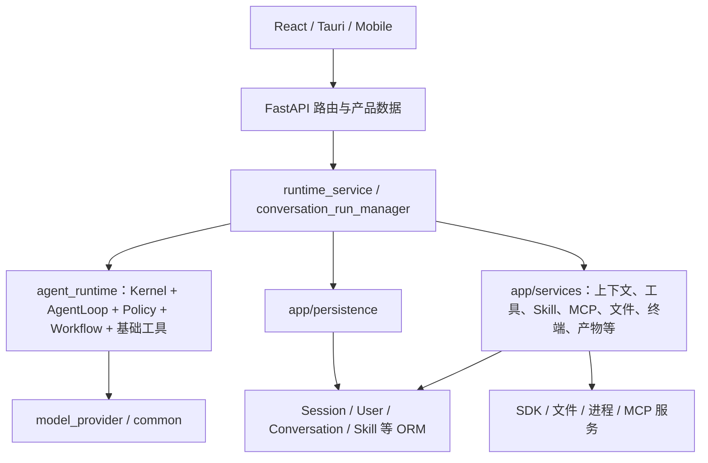

# 新旧架构差异、问题与迁移验收

> 2026-09-04 源码核对，基线 `06b41ae92370762c52f35c4607c3c08002dd48bf`。本文中的“旧架构”指这次拆分前的当前实现，不指已经移除的历史 Session/Orchestrator。旧问题保留为拆分前证据；本次已实现的处理见下表和 [CLI 实施记录](./cli-mvp.md)。源码链接已指向迁移后的当前文件。

## 1. 旧架构的形态与已有基础

旧结构适合先把产品跑通：Web 对话、用户权限、工具配置、数据库记录和实时 UI 能在一个后端中串联。已经建立的 Kernel/Port、唯一终态、Context CAS、持久事件、团队消息和可信工作树边界应当保留。

问题在于“产品集成方便”和“通用能力可独立使用”是两件事。许多本可独立的机制以 Web 业务对象为入口；运行时包自身又包含默认执行与产品启发式。新增一个 CLI 时，很容易被迫导入整个 Web 后端，或复制一套能力实现。

之前的 APO 快照 `snap_d3d4dc38eea04ddb925c49880b7b6950` 在配置范围内解析了 594 个文件，并非整个仓库只有这些文件。这个数量包含测试与不同客户端，不能直接推断架构质量。静态依赖用于定位线索，以下问题以对应源码为依据；解析成功不证明运行正确，也不能用图中未解析关系判定功能缺失。

## 2. 新旧架构对照

| 维度 | 旧架构 / 当前实现 | 新架构 / 目标 | 预期效果 |
| --- | --- | --- | --- |
| 系统中心 | Web app 集成多数能力 | Kernel 控制，子系统供能，各宿主组装 | 增加 CLI/eval 时不复制执行系统 |
| Runtime 的含义 | 包内混有 Kernel、默认 loop、工具、Workflow | Kernel 与执行/策略等子系统按职责分离 | 内核稳定，执行方式可以替换 |
| 输入对象 | Session、User、Conversation、Skill 等遍布执行入口 | 通用 spec、ExecutionContext、明确 Port | 本地与 Web 能共用实现 |
| 授权 | 用户 RBAC、Agent 工具权限、具体工具检查分散；部分路径只告警 | 宿主授予有效 grants，执行点统一落实并记录拒绝 | 无宿主也能测试权限，不因嵌套调用扩大授权 |
| 上下文 | SQL ContextBuilder 负责多种产品来源 | 通用装配/压缩/记忆 + 宿主 contributors | CLI 消费本地 Scope，而非伪造 Web 会话 |
| 工具生态 | 工具/Skill/MCP 执行器调用彼此的应用实现 | 公开调用接口、handler 注册、构造注入 | 组合复用且避免实现导入环 |
| 文件与终端 | 路径/进程机制与产品会话/记录混合 | 通用资源服务 + 本机驱动 + 产品资源映射 | 可独立验证 cwd、取消、清理与输出 |
| 模型访问 | 有独立 Provider 包，但加载与应用配置仍有耦合 | 通用接口、按需驱动、宿主凭据解析 | 最小环境不加载所有模型 SDK |
| 持久化 | Runtime scope 在 SQL 中绑定 Conversation | 通用 Scope/Journal 契约，Web 与本地存储分别实现 | 不依赖用户/会话表也能持久运行 |
| 产物 | 渲染、落库、Artifact ID、下载 URL 常一起返回 | 内容生成返回资源事实，宿主做业务归属和发布 | CLI 可生成文件，Web 仍保留卡片与版本 |
| Workflow | runtime 与应用有多处图/状态机制，画布与 ORM 紧耦合 | 通用图/节点能力/状态 + 宿主画布映射 | 调度经同一 Kernel 收敛 |
| 发行 | 一个完整 backend 依赖集合，桌面打包后端 | 最小 Kernel/CLI 能力集合，可选 SDK/文档/Web 依赖 | 独立安装和问题定位更容易 |
| 验证 | 内核单测与 Web 集成验证为主 | 契约测试 + Web/CLI 共享链 + eval 场景 | 可以验证完整 harness，而非只有生命周期 |
| 可恢复性 | 事件补拉、Context 跨 Run；进程丢失失败 | 先保持当前语义；未来单独设计检查点 | 避免把重放包装成崩溃续跑 |

## 3. 拆分前的问题与证据（保留基线）

下列 P1–P11 描述拆分前状态，不应将旧耦合描述视为迁移后仍全部存在。

| 问题 | 本次处理 | 剩余事项 |
| --- | --- | --- |
| P1 执行与产品耦合 | Loop 迁入 execution；WebExecutionExtension 注入产品规则；Kernel 改用公共错误 | 复杂策略/旧 function_loop 后续收敛 |
| P2/P3/P6 工具与资源 | 公共 registry/invoker，CLI grants，文件及 Windows 驱动 | Web RBAC、Skill/MCP、常驻终端仍待抽取 |
| P4 历史缺口 | ContextSnapshot 进入执行器，裁剪保留完整轮次与当前输入 | 自动摘要未引入 |
| P7 Scope 存储 | CLI SQLite 不依赖 User/Conversation 外键 | Web 表未变动；本地 TeamJournal 不在 MVP |
| P10 发行 | 根级共享 wheel、可选 CLI 依赖、SDK 延迟导入 | 真实 Provider 验收需显式配置 |
| P11 恢复 | 会话锁、取消、process_lost、只读 replay | 不恢复崩溃执行点；其他高级恢复待实现 |
| 新确认：失败误报成功 | FAILED/BLOCKED 提案传入 Kernel failed 终态 | 不以模型文字代替任务结果验证 |

### P1. “包已独立”尚不等于“Kernel 已纯化”

[`agent_loop.py`](../../src/agent_subsystems/execution/agent_loop.py) 同时承担模型/工具循环、产物选择与部署相关判断，并导入 [`common/artifact_heuristics.py`](../../backend/src/common/artifact_heuristics.py)。[`engine.py`](../../src/agent_runtime/runtime/engine.py) 还直接引用 `model_provider.core.streaming.OutputTokenLimitExceeded`。

**影响：** 单次产品交付规则改变可能影响通用 Agent 执行；内核仍感知模型包的异常类型。现有 [`test_dependency_boundary.py`](../../backend/tests/test_agent_runtime/test_dependency_boundary.py) 只禁止直接导入 `app`/`db`，不能发现藏在 `common` 中的产品语义或证明最小安装。

**目标处理：** 默认 loop 归 S1，厂商异常归一化到通用契约，产品启发式归 H1。保留当前 Runtime 公共契约和行为回归，不新建第二套内核。

### P2. 通用能力的入口被 ORM 和 Web 身份绑定

[`tools/executor.py`](../../backend/src/app/services/tools/executor.py) 的 `invoke_tool[_async]` 接收 `Session` 和 `User`，内部读取定义、创建调用记录后派发；[`skills/runtime.py`](../../backend/src/app/services/skills/runtime.py) 接收 ORM Skill 并创建 SkillRun；[`mcp/transports/http.py`](../../backend/src/app/services/mcp/transports/http.py) 与 [`stdio.py`](../../backend/src/app/services/mcp/transports/stdio.py) 连传输层都接收 ORM server/invocation。外部 Agent 的 [`base.py`](../../backend/src/app/services/external_agents/base.py) 接口也带 User 和 ExternalAgentRun。

**影响：** CLI 若直接复用这些接口，就要初始化产品用户、数据库和会话；改名或换目录不能解除依赖。

**目标处理：** 分离通用 spec、执行逻辑、Record Port 与宿主数据适配。现有 Web 路由和 ORM 暂时保留，通过适配器调用抽出的同一个实现。

### P3. 授权规则尚未完全收敛为统一执行契约

[`tools/permissions.py`](../../backend/src/app/services/tools/permissions.py) 的 `check_user_tool_permissions` 默认 `strict=False`；统一执行器显式使用该模式，把缺失权限作为 `permission_warnings` 返回。与此同时，Agent 能力过滤、具体工具与可信执行根又存在各自约束。

**影响：** 不能仅根据“配置了 permissions”就断言所有路径会拒绝缺失权限；另一个宿主也难以复用一套清晰的能力策略。这不等于已经证明所有工具均能越权，实际入口仍需逐项核对。

**目标处理：** 将身份/RBAC 到 grants 的转换留宿主；通用执行点统一落实授权、schema、资源约束，嵌套调用只能继承或收窄。拒绝应在产生外部副作用之前发生并可审计。行为收紧属于后续独立代码变更，需要更新宿主调用方和拒绝路径测试。

### P4. 跨 Run 的存储契约与默认执行器消费路径不完整对齐

Kernel 会把 Scope 快照放入执行请求，但 [`AgentLoopExecutor`](../../src/agent_subsystems/execution/agent_executor.py) 调用 loop 时主要传入 `request.context.blackboard`、context provider 和 metadata，并未直接将 `request.context.messages` / `agent_memories` 交给 loop。Web 通过 [`runtime_service.py`](../../backend/src/app/services/runtime_service.py) 的 `_ContextBuilderProvider` 与 SQL [`ContextBuilder`](../../backend/src/app/services/context/builder.py) 补充产品历史。

**影响：** “ContextStore 可以保存历史”不能证明“默认执行器在脱离 Web 时能正确使用历史”。现有 Web 历史并非因此全部失效；问题是完整能力依赖隐藏在宿主中。

**目标处理：** S4 显式消费通用快照与授权来源；S1 使用同一构建接口。以同一 Scope 连续两个 Run 的输入/记忆断言验收，不只测试存储 load/commit。

### P5. 工具与 Skill 的组合存在实现回路和厂商绑定

Web 工具派发会进入 Skill Runtime，而 [`skills/runners/script.py`](../../backend/src/app/services/skills/runners/script.py) 又直接导入 `app.services.tools.executor.invoke_tool_async`。[`runners/prompt.py`](../../backend/src/app/services/skills/runners/prompt.py) 直接依赖应用侧 Ark 客户端。

**影响：** 简单按目录抽包会形成循环依赖，且不同入口的模型调用、预算与取消难以统一验证。依赖本身不证明某次运行已经超预算，但说明约束需要跨路径验证。

**目标处理：** ToolInvoker/Model 接口注入；宿主把 Skill/MCP 等注册成 handler。对嵌套调用传播有效权限、预算、取消、父调用 ID，不新建隐式无限制执行链。

### P6. 进程与文件机制、资源归属和产品记录混在一起

[`terminal/executor.py`](../../backend/src/app/services/tools/builtins/terminal/executor.py) 同时包含 TerminalManager、TerminalProcess、输出缓冲和 SandboxSession/User/Session；[`workspaces/filesystem.py`](../../backend/src/app/services/workspaces/filesystem.py) 混合通用路径处理与应用设置；[`worktrees.py`](../../backend/src/app/services/worktrees.py) 同时操作 Git 与 Conversation 仓库绑定。

**影响：** 独立进程能力难以复用；进程活句柄与数据库运行记录容易被误认为同一种可恢复状态；取消、进程树终止和文件保留责任不易集中验证。

**目标处理：** S6 拥有资源操作和句柄；宿主映射 scope/agent、拥有者与保留策略。保持可信根校验，不把路径边界或 Python 模块拆分当作生产隔离保证。

### P7. 通用 Scope 在持久化层仍等同于 Conversation

[`db/models/runtime.py`](../../backend/src/db/models/runtime.py) 的运行、事件、上下文等 Scope 字段引用 `conversations.id`；[`app/persistence`](../../backend/src/app/persistence) 使用这些产品模型、Session 与加密字段。

**影响：** 内核参数看似通用，持久化实现却要求 AgentHub 会话存在；CLI 无法只靠一个本地 Scope ID 使用现有 SQL 适配器。

**目标处理：** 保留 Web SQL 适配器，增加独立本地存储实现，而不是立即重写产品表。两种驱动都遵守同一 Journal/Context/Team 原子性与版本契约；以后若迁移数据库，必须附独立 Alembic 方案和数据兼容策略。

### P8. 内容生成与 Web 产物发布尚未分层

[`artifact/storage.py`](../../backend/src/app/services/tools/builtins/artifact/storage.py) 同时包含生成文件、Artifact/FileAsset 落库与带服务器 URL 的 descriptor；[`document_model`](../../backend/src/app/services/document_model) 有可复用结构和渲染，也有产品模板及提示规则。

**影响：** CLI 想生成一个文档，也可能被迫创建产品 Artifact 记录；产物生成成功、下载链接可用和部署成功容易混淆。

**目标处理：** S10 返回实际内容与资源引用；AgentHub 完成版本、拥有者、卡片、下载和预览部署。外部转换依赖按格式隔离加载，失败保留原因。

### P9. Workflow 的图机制、应用持久化与展示状态存在多处边界

[`agent_runtime/workflow`](../../src/agent_runtime/workflow)、[`strategies`](../../src/agent_runtime/strategies) 与 [`app/services/workflows`](../../backend/src/app/services/workflows) 都包含图、调度或执行相关逻辑；应用 `runtime.py` 还负责 ORM 状态与锁。当前 Workflow 遍历保留可变游标。

**影响：** 不能按现有目录直接宣称只有一个完整通用图执行器，也不能把持久节点状态当成可由事件完全恢复的执行状态。

**目标处理：** 收敛 S9 图/节点接口与 S2 调度桥，Kernel 仍唯一负责父 Run 终态；画布兼容转换和 WorkflowRun 读模型留宿主。逐类节点迁移，以现有画布回归验证行为。

### P10. 发行和验证范围还围绕完整后端

[`backend/pyproject.toml`](../../backend/pyproject.toml) 在同一基础依赖中包含 FastAPI、SQLAlchemy、多个 Provider SDK、Office/PDF/OCR 等；[`model_provider/factory.py`](../../src/model_provider/factory.py) 导入各 Provider。当前 [`app/cli.py`](../../backend/src/app/cli.py) 只有 `create-admin`，桌面 sidecar 也复用完整后端。

**影响：** Kernel 能通过单测与“可在没有 Web/DB/文档依赖的环境运行完整 Agent”之间仍有距离。把现有 API 套一个终端界面不能验证这种独立性。

**目标处理：** 最小安装烟测、可选依赖、CLI 与 eval 的直接宿主路径。日志由宿主配置；例如现有 [`common/logger.py`](../../backend/src/common/logger.py) 配置时可使用 stdout handler，CLI 必须显式保证 JSONL stdout 不受日志干扰，不能仅依赖默认配置。

### P11. 观测持久化、活任务恢复和真实任务成功仍需区分

[`ConversationRunManager`](../../backend/src/app/services/conversation_run_manager.py) 的输入队列依赖单进程；慢 Sink 和满 Mailbox 仍可能等待；[`skills/runtime.py`](../../backend/src/app/services/skills/runtime.py) 有显式 mock/fallback；现有事件补拉并不恢复 Actor、终端或外部 Agent 的活进程。

**影响：** 如果评测只看有文本输出、运行记录存在或能补拉事件，会高估 harness 的可靠性和完成率。

**目标处理：** 分别报告排队、执行、工具结果、降级、终态、投影和资源释放。慢消费者隔离、跨进程协调和安全检查点是明确的后续能力，不能借架构文档把它们标成已实现。

## 4. 旧模块到新职责的迁移表

此表与[模块目录](./subsystems.md)配合使用。一个旧模块可能同时需要“抽出通用部分”和“保留产品适配”，不能机械整包移动。

| 当前代码域 | 通用目标 | 留在 AgentHub 宿主 |
| --- | --- | --- |
| `agent_runtime/core`、engine/actor/mailbox/watchdog/cancellation | K 与轻量领域契约 | 调用方随迁移更新，不保留旧导出别名 |
| `agent_runtime/runtime/agent_loop.py`、agent_executor/status_report | S1 | 产物、全栈、部署提示与交付规则 |
| `agent_runtime/strategies`、team_tools | S2；消息权威仍 K | 产品 Team Lead 偏好与发布选择 |
| `agent_runtime/context`、`app/services/context`、knowledge | K 的存储契约 + S4 装配/记忆/检索 | DB 来源、附件权限、workspace/conversation 数据映射 |
| `model_provider`、model_config_resolver、services/llm | S3 | 拥有者/密钥解析、产品模型目录、旧 API 兼容 |
| `agent_runtime/tools`、`app/services/tools` | S5 调用/授权；具体能力归对应子系统 | CRUD、用户定义、产品参数兼容与 ORM 记录适配 |
| execution_roots、workspaces/filesystem、files、terminal、sandbox、worktrees/git_collaboration | S6 | Conversation/Agent 绑定、文件树产品模型、保留策略 |
| `app/services/mcp`、mcp_runtime | S7 | 配置所有权、记录、管理 API 和旧 facade |
| `app/services/skills` | S8 | 用户安装、目录、发布/测试 API 与旧 manifest 入口 |
| runtime workflow + services/workflows | S9 + S2 调度桥 | 画布/Conversation/WorkflowRun 与前端状态映射 |
| document_model、file converters、artifact renderers/storage/export | S10 | Artifact/FileAsset、版本、下载 URL、部署发布 |
| external_agents、外部工具 wrapper、API/browser probes | S11 + S5 handler + S6 资源 | 用户运行记录、管理配置与兼容调用名 |
| app/persistence、runtime projection、realtime、common/logger、audit | S12 公共消费/记录接口与通用驱动 | 产品 SQL、generation/message、RBAC 审计、HTTP/SSE/WS |
| runtime_service、conversation_run_manager、chat/tasks、api/core、db | H1 | 继续作为产品与组合入口，逐步委托通用机制 |
| frontend、desktop-client、mobile-client、docker/scripts | H4/H5 | 保留客户端和发行职责，不进入 Kernel |

## 5. 执行中的 M0–M4 计划

| 阶段 | 迁移与开发范围 | 验收 |
| --- | --- | --- |
| M0 结构和基线 | 根级目标目录、每域职责、原实现位置 | 记录基线与迁移状态 |
| M1 共享发行 | Runtime/Provider 迁入 `src`；根级 workspace/锁；调用方同步 | 无 Web 依赖导入 Kernel；Web 可启动 |
| M2 持久对话 | 公共 Loop/SingleAgentPolicy、配置、DPAPI/env、信任、SQLite、REPL/续聊 | 历史真正进入模型；失败不会转成功 |
| M3 本机操作 | 文件/hash、PowerShell、Git、目录授权、Job Object 与记录 | 实际修改和测试；取消/超时/崩溃清理 |
| M4 安装收尾 | 独立 wheel、JSONL/replay/doctor、Web/桌面构建回归、验收记录 | 干净安装；区分替身、真实服务和未验证项目 |
| 后续 | MCP/Skill/Workflow/内容/外部 Agent 逐项迁移、团队治理、强隔离 | 每项单独建立闭环，不作为 MVP 已实现能力 |

REPL 和会话持久化已提前到 M2。本次直接安装共享包验证，不等待全系统搬迁；没有兼容别名，也不同时运行两套有副作用的实现。实时阶段状态及证据见 [CLI 实施记录](./cli-mvp.md)。

## 6. 迁移规则与回退

1. **公共 API：** 迁移时更新全部调用方和测试，删除旧位置与旧导出，不设转发别名，不恢复旧 Session/Orchestrator。
2. **Web 行为：** 路由、SSE/WS 字段、`generation_id == run_id`、Artifact URL、画布 schema 在迁移窗口保留；通用结果通过产品投影转换，不能直接把新 DTO 推给旧前端。
3. **数据：** 初期保留 AgentHub 表和加密字段；本地驱动有自己的 schema 版本。需要改产品 schema 时附迁移、旧数据读取/回退策略，不顺带修改外键或删除历史记录。
4. **配置与权限：** 产品默认值留宿主；CLI 必须明确自身的有效授权和能力集。缺失凭据、依赖、权限均显式返回，不能通过无提示 mock 让验收“通过”。
5. **副作用：** 一条入口切换到新实现后，只执行一次外部操作；不通过“双跑”比较文件写入、进程、MCP 或外部 Agent。只读轨迹比较可使用替身或独立临时工作区。
6. **回退：** 每阶段保留独立提交；若契约回归，回退该阶段并保留已产生的 Journal/用户文件，不通过删除证据恢复表面状态。

## 7. 验收矩阵

下表是后续代码工作的验收要求，**不是本轮已通过的测试报告**。优先复用现有测试，加上能够区分错误实现的行为断言，不为目录移动重复编写形式测试。

| 验收层 | 场景 | 必须观察到的证据 |
| --- | --- | --- |
| 安装与导入 | 最小环境安装 Kernel + 基础 CLI；不装 Web/数据库/OCR/未选 SDK | 能导入和执行基础任务；缺失可选能力只影响对应命令，不能通过测试环境预装全部依赖掩盖问题 |
| Kernel | 完成/取消竞争、超时/预算、迟到写、Context 冲突 | 唯一终态、稳定原因、租约失效、无迟到 Context 改写 |
| 事件与存储 | 幂等追加、序号冲突、终态 CAS、重放、旧历史缺口 | append-before-publish、原子终态事件、游标连续、重复消费幂等、显式 history_complete |
| 上下文 | 同一 Scope 两次 Run 与不同 Scope 隔离 | 第二次模型输入实际包含第一轮允许保存的信息；不泄露其他 Agent 私有上下文 |
| 基础工具 | 临时目录读写、argv 执行、真实退出码与输出 | 文件/输出确实存在；不以模型声称已创建作为成功证据 |
| 授权 | 空 grants、缺少权限、模型伪造 root、嵌套 Skill 调工具 | 副作用之前拒绝，记录 denial；嵌套不能扩大权限；根不可由模型参数替换 |
| 进程与终端 | 输入等待、超时、Ctrl+C、输出过量、进程树退出 | 取消有限时收敛、输出截断明确、无应被关闭而残留的进程；不能承诺无法实现的同步抢占 |
| 模型 | 真实 usage/估算、工具调用流、超限关流、认证/限流错误 | 明确 usage 来源、停止输出、错误分类、取消传播 |
| Skill/MCP | 四类 runner、嵌套调用、服务缺失、坏 schema、传输失败 | 标准结果、父子调用关联、授权和预算继承；fallback 明确标记 |
| 团队 | 私信/广播/开放线程、成员工作树、失败时待处理消息 | 收件人隔离、预算有效、工作树可信、消息 interrupted，不被下一 Run 隐式续用 |
| Workflow/内容 | 分支/循环/失败节点；实际文档生成与缺失转换器 | 节点状态正确，父 Run 由 Kernel 收敛，引用对应真实内容，降级不被抹掉 |
| 宿主一致性 | Web 与 CLI 使用相同输入规格、替身 Provider 和能力集 | 核心终态、工具结果和 Context 等价；忽略宿主专属 ID、时间戳和展示差异 |
| CLI 协议 | JSONL、stderr 日志、成功/失败/取消/配置错误 | stdout 可逐行解析、终态明确、退出码稳定、无密钥/原始推理落盘 |
| 真实 harness | 显式凭据、固定任务集、文件/工具/测试结果检查 | 保存代码/配置/模型版本、任务结果、失败、用量与耗时；mock/未执行单列 |

评测报告至少记录任务 ID、代码版本、模型与驱动配置的非敏感部分、能力集、工作区基线、执行结果、终态原因、工具证据、用量及其估算标记、耗时和未完成项。真实模型具有随机性，不要求与替身测试逐字一致，但成功条件必须预先确定且由可检查结果支撑。

## 8. 本轮交付边界

已交付根级共享发行包、可安装 CLI、本地驱动与执行链测试。CLI 直接组装公共 Runtime；Web 的 `runtime_service` 注入相同 AgentLoopExecutor 并提供产品扩展。尚存的 Web `services/agents/function_loop.py` 和非 MVP 子系统未在本期全面收敛。

Windows 执行采用当前用户权限。文件工具与命令 cwd 校验、环境过滤及日志脱敏不能形成 OS 沙箱；PowerShell 仍可访问授权目录集合之外的资源。Job Object 仅管理进程树生命周期。真实模型验收和环境依赖的构建以实施记录为准，不以确定性替身代替。

## 9. Harness 0.1.1—0.1.5 增量迁移

本轮新增公共执行限制与阶段观察、源码发现策略、每次请求的上下文整理、同 scope 结果检索和失败续接。Kernel 正常完成通过 RunCompletionPort 一次提交 Context CAS、续接游标、Run 结果与终态事件；SQLite、SQL 与内存适配器采用相同语义。普通工具错误仍由模型处理，资源与协议停止由 Kernel 提交明确原因。

新本地数据库为 schema v2，旧 v1 数据通过迁移锁、会话锁、一致性备份与事务迁移保留。Web 新增续接元数据列，0.1.5 将迁移链正确接在现有工作树迁移之后。尚未迁移的业务模块和多 Agent 权限治理仍按原归属保留。逐版证据、已发现问题及实际验收状态见 [Harness 版本记录](./harness-releases.md)。
