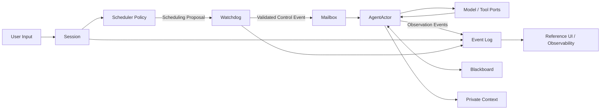

# Runtime 目标架构

> 状态：目标设计。本文不声明当前代码已经满足这些契约；实现差距见[当前实现对照](./current-state.md)。

## 核心命题

多智能体系统不是“依次调用几个模型”的脚本。它要协调多个不确定、长耗时、可能失败的执行实体，同时维持资源边界、上下文隔离、因果顺序和可恢复状态。

本 Runtime 将 Agent 视为**协作式 Actor**：

- `Session` 是一次运行的生命周期与隔离边界。
- `AgentActor` 持有私有状态，通过 `Mailbox` 接收控制事件。
- `SchedulerPolicy` 基于共享事实和状态报告提出调度建议。
- `Watchdog` 校验建议并执行不可逾越的硬限制。
- `Blackboard` 保存协作所需的共享事实，`PrivateContext` 保存单个 Agent 的私有过程。
- `EventEnvelope` 记录控制、观测和因果关系，使运行过程可重放、可审计。

LLM 擅长语义判断，但不能成为资源和状态真源。它拥有建议权；Runtime Kernel 和 Watchdog 拥有状态转换、权限、预算和终止控制权。

## 目标数据流

一次典型执行遵循以下顺序：

1. `Session` 接收用户输入，建立本轮关联标识和不可变状态快照。
2. `SchedulerPolicy` 读取快照、Agent 报告与 Blackboard，返回调度提案，不直接修改运行时。
3. `Watchdog` 根据预算、生命周期和权限验证、修复或拒绝提案。
4. Kernel 将通过验证的动作编码为控制事件，经目标 Agent 的 `Mailbox` 投递。
5. `AgentActor` 在协作式检查点消费控制事件，调用 Model 或 Tool 端口，并发布观测事件。
6. 状态、上下文和事件按明确的持久化边界提交；终态只能由 Kernel 收敛一次。

## 四层边界

| 层 | 职责 | 不应包含 |
| --- | --- | --- |
| Runtime Kernel | Session、Actor、Mailbox、事件顺序、状态机、Watchdog、取消与恢复 | 具体业务任务判断、模型厂商协议、UI 表现 |
| Policies | 调度、完成判定、冲突处理、上下文选择策略 | 直接写 Actor 状态、绕过 Watchdog、直接操作数据库 |
| Adapters | Model、Tool、Persistence、EventSink 等外部能力适配 | 改写调度语义、伪造成功或终态 |
| Reference Application | AgentHub 聊天、工作流和可观测界面 | 反向把产品特例写入 Kernel |

### Runtime Kernel

Kernel 只处理确定性的系统问题：谁拥有状态、事件如何排序、控制如何投递、资源何时耗尽、任务如何取消，以及崩溃后能恢复到哪里。它不理解“全栈项目”“生成 PDF”或“部署预览”。

### Policies

策略是可替换的。单 Agent 直通、LLM Team Leader、静态 Workflow 或其他调度方式应共享同一 Kernel 契约。策略输入是运行时快照，输出是提案；相同输入可以被记录和回放，以便比较不同策略。

### Adapters

外部能力通过端口接入：

- `ModelPort`：模型调用、流式增量、取消和用量报告。
- `ToolPort`：工具发现、授权执行、取消和结果记录。
- `PersistencePort`：快照、事件、Blackboard 和私有上下文持久化。
- `EventSink`：向日志、前端或消息系统输出事件，不反向控制 Kernel。

端口失败必须形成明确结果，不能被转换成伪成功。

### Reference Application

AgentHub 前后端保留为参考应用和 Runtime Observatory。它可以展示 Actor 状态、调度提案、Mailbox、Blackboard 版本和事件时间线，但不决定内核语义。

## 状态所有权

| 状态 | 唯一所有者 | 其他组件的权限 |
| --- | --- | --- |
| Session 生命周期与终态 | Runtime Kernel | Policy 只能建议完成；Adapter 只能报告失败 |
| Agent 运行状态 | AgentActor + Kernel 状态机 | Scheduler 通过控制事件提出转换请求 |
| 共享事实 | Blackboard | Agent 通过受控命令读取或提交版本化更新 |
| 私有过程 | 对应 Agent 的 PrivateContext | 其他 Agent 不可直接读取 |
| 调度历史与因果链 | Event Log | 所有组件只追加，不就地改写历史 |

## 非目标

以下事项不属于 Runtime Kernel：

- Agent 社区、积分、市场、内容管理等平台能力。
- PDF、Office、HTML 等产物生成规则。
- “后端先于前端”等全栈项目交付模板。
- 特定云平台部署和生产级沙箱基础设施。
- 聊天工作台的视觉扩张或移动端功能。
- 依靠更多 Prompt 修补事件顺序、权限或终态一致性。

这些能力可以作为 Policy、Tool 或参考应用存在，但不得改变 Kernel 的通用契约。
