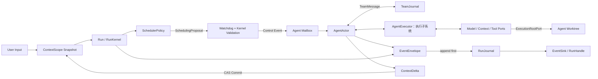

# Runtime 目标架构

> 本文定义目标契约。已落地范围与差距见[当前实现对照](./current-state.md)。

本文聚焦 Runtime Kernel。[系统架构](../architecture/README.md)补充内核之外的执行、模型、工具、MCP、Skill、文件/进程等子系统与 Web/CLI/eval 宿主边界；当前包名 `agent_runtime` 不等于纯内核范围。

## 核心命题

Runtime 采用双层生命周期：

- `ContextScope` 由 `context_scope_id` 标识，跨 Run 保存消息、版本化 Blackboard 和结构化 `AgentMemory`。
- `Run` 对应一次用户请求，由 `run_id` 标识，拥有 Actor Task、Mailbox、Watchdog、事件序号、预算和唯一终态。
- `AgentActor` 是 Run 内的协作式 Actor，只通过私有 `Mailbox` 接收控制事件。
- `SchedulerPolicy` 只读取 `PolicySnapshot` 并返回 `SchedulingProposal`。
- `Watchdog` 与 Runtime Kernel 拥有资源、权限、状态转换和终态控制权；LLM 只有语义建议权。

`RuntimeEngine` 是可复用内核入口，持有注入的 AgentExecutor、ContextStore、Journal 和 EventSink 等依赖，但不保留已终止 Run。Model、Tool 和上下文装配由执行子系统使用；具体驱动的构建与共享资源关闭由宿主组合入口负责，Engine 不承担全系统服务定位器职责。调用者通过 `RunHandle` 观察事件、查询快照、等待结果和执行可收敛取消。

## 公共调用方式

```python
handle = await engine.start(RunRequest(
    run_id=generation_id,
    context_scope_id=conversation_id,
    input=user_input,
    agents=agents,
    policy=policy,
))

async for event in handle.events():
    ...
result = await handle.result()
```

## 目标数据流



完成提案只有在预算仍有效且 Actor Task 已收敛时，才能由 Kernel 提交为 `completed`；终态提交随即撤销写租约。主动取消产生 `cancelled`；超时、预算耗尽、策略或 Adapter 错误、上下文冲突及 Runtime 关闭产生 `failed`。

## Kernel 与系统各层的边界

| 层 | 职责 | 禁止内容 |
| --- | --- | --- |
| Runtime Kernel | Run 状态机、Actor/Mailbox、Watchdog、取消、事件顺序和 Context CAS | 产品任务判断、厂商协议、UI 语义 |
| 执行与能力子系统 | AgentExecutor、默认 AgentLoop、模型、上下文、工具、Skill/MCP、Workflow 等 | User/Conversation ORM、UI 语义、独立提交父 Run 终态 |
| Policies | 从快照生成调度提案；通用策略属于子系统，产品策略属于宿主扩展 | 投递控制事件、改 Actor、写数据库、提交终态 |
| 驱动与存储适配器 | Provider SDK、文件/进程、ContextStore、RunJournal、TeamJournal、EventSink 实现 | 改写调度语义、伪造成功、绕过租约 |
| 宿主与参考应用 | AgentHub 聊天/画布/投影，计划中的 CLI/eval 组装与展示 | 将全栈交付或部署特例反向写入 Kernel；复制通用执行循环 |

各层通过公开契约协作；[子系统目录](../architecture/subsystems.md)给出模块归属。Kernel 只理解执行请求与结果，不直接编排模型/工具循环。Scope 历史能存储与执行器能正确消费历史是两项不同要求，现状差距见 `current-state.md`。

## 状态所有权

| 状态 | 唯一所有者 | 持久化边界 |
| --- | --- | --- |
| Run 状态、预算、序号和终态 | RunKernel | `RunJournal.try_finish` 原子写终态与终态事件 |
| Agent 执行状态 | Run 内 AgentActor + Kernel | 结构化报告和事件 |
| 共享事实 | ContextScope Blackboard | `ContextStore.commit(expected_version, delta)` |
| 长期 Agent 记忆 | ContextScope `AgentMemory` | 摘要、任务、阻塞项、事实、产物引用 |
| 推理草稿和临时工具帧 | 当前 Adapter 调用 | 不进入跨 Run ContextState |

## 团队协作域

通用协作域由 `context_scope_id` 标识；下文描述当前 AgentHub 将 Conversation 映射为协作域的实现约束。现有 SQL 仍绑定 Conversation，计划中的本地宿主应提供独立 Scope 存储，不能把产品模型移入 Kernel。

一个群聊 `Conversation` 是一个协作域，一个活跃 `Run` 可以并行驱动多个平权 `AgentActor`。Kernel 不理解 Leader、Reviewer 或 Integrator；这些职责来自 Agent 系统提示词、用户配置和工具权限。`summary_agent_id` 只是没有待处理消息后唯一一次最终汇总的投递目标，不获得调度、终态或资源控制权。

Agent 只能通过 `TeamMessenger` 主动公开消息。私信仅进入目标 Agent 下一轮的 `AgentExecutionRequest.inbox`，广播进入除发送者外所有成员的收件箱；完整提示词、私有推理和临时工具帧始终隔离。消息发送不等待对方模型调用，`expects_reply` 只创建开放线程并让 Policy 在下一安全检查点优先调度收件人。

`TeamJournal` 为 Conversation 分配单调团队序号，并将 `TeamMessage` 与对应的 Run Event 原子提交。Runtime 事件仍保持各 Run 内的独立序号。Run 取消、失败或进程丢失时，尚未消费的团队消息转为 `interrupted`，不得被下一 Run 隐式续用。详细协议见[平权协作语义](./collaboration.md)。

## 工作树执行边界

一个团队 Conversation 可以绑定一个 Git 仓库与基准提交。AgentHub Adapter 为每个 Agent 解析可信的 `ExecutionRootPort`，文件、终端、沙箱、外部 CLI Agent 和 Git 工具只能在该 Agent 的工作树中执行。模型参数不是路径权限来源，不能用绝对路径或 `..` 越过执行根。

managed 工作树由 AgentHub 在应用数据目录创建，adopted 工作树必须是同一 Git common dir 中已注册的独立工作树。工作树跨 Run 复用，Conversation 归档不隐式删除。`git.integrate` 只把同一 Conversation 成员的分支合并到调用者自己的干净分支；冲突会安全 abort，并通过团队消息交还 Agent 继续讨论。Kernel 不判断谁应当集成，详细契约见[工作树与 Git 协作](./worktrees.md)。

## Event Log 与重放

每个新 Run 使用 Journal version 1。Kernel 在序号锁内分配 `sequence`，调用 `RunJournal.append_event()` 成功后，才唤醒 `RunHandle` 订阅者并投递实时 Sink。同一 `event_id` 的相同重试是幂等操作；同一 Run/sequence 的不同内容是显式冲突。`RunHandle.events(after_sequence=...)` 和 HTTP 查询均使用独立游标分页读取，不依赖单消费者内存队列。

终态 CAS 与唯一终态事件由 `RunJournal.try_finish()` 在同一事务提交。AgentHub generation、消息和 consumer cursor 也在同一投影事务更新；事务成功后才发布 WebSocket。旧 Run 不伪造事件历史，查询以 `history_complete=false` 标明缺口。

Journal 载荷先递归脱敏再通过 `ContentJSON` 加密保存，最终输出也以加密字段保存。`thinking`、`reasoning`、`reasoning_content` 和凭据不进入 Event Log、Message、generation 读模型或长期 Context；思考内容只在当前实时连接中展示。

## 非目标

社区、积分、市场、Office/HTML 产物规则、全栈交付模板、特定云部署、生产沙箱、团队角色枚举和 UI 扩张均不属于 Kernel。它们只能位于 Policy、Tool、Adapter 或参考应用。
