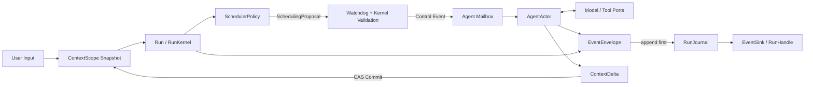

# Runtime 目标架构

> 本文定义目标契约。已落地范围与差距见[当前实现对照](./current-state.md)。

## 核心命题

Runtime 采用双层生命周期：

- `ContextScope` 由 `context_scope_id` 标识，跨 Run 保存消息、版本化 Blackboard 和结构化 `AgentMemory`。
- `Run` 对应一次用户请求，由 `run_id` 标识，拥有 Actor Task、Mailbox、Watchdog、事件序号、预算和唯一终态。
- `AgentActor` 是 Run 内的协作式 Actor，只通过私有 `Mailbox` 接收控制事件。
- `SchedulerPolicy` 只读取 `PolicySnapshot` 并返回 `SchedulingProposal`。
- `Watchdog` 与 Runtime Kernel 拥有资源、权限、状态转换和终态控制权；LLM 只有语义建议权。

`RuntimeEngine` 是可复用 Adapter 容器，可缓存 Model、Tool、Persistence 和 EventSink，但不保留已终止 Run。调用者通过 `RunHandle` 观察事件、查询快照、等待结果和执行可收敛取消。

## 公共调用方式

```python
handle = await engine.start(RunRequest(
    run_id=generation_id,
    context_scope_id=conversation_id,
    input=user_input,
    agents=agents,
    policy=policy,
))

async for event in handle.events():
    ...
result = await handle.result()
```

## 目标数据流



完成提案只有在预算仍有效且 Actor Task 已收敛时，才能由 Kernel 提交为 `completed`；终态提交随即撤销写租约。主动取消产生 `cancelled`；超时、预算耗尽、策略或 Adapter 错误、上下文冲突及 Runtime 关闭产生 `failed`。

## 四层边界

| 层 | 职责 | 禁止内容 |
| --- | --- | --- |
| Runtime Kernel | Run 状态机、Actor/Mailbox、Watchdog、取消、事件顺序和 Context CAS | 产品任务判断、厂商协议、UI 语义 |
| Policies | 从快照生成调度提案 | 投递控制事件、改 Actor、写数据库、提交终态 |
| Adapters | Model、Tool、ContextStore、RunJournal、EventSink | 改写调度语义、伪造成功、绕过租约 |
| Reference Application | AgentHub 聊天、Workflow、事件投影和可观测界面 | 将全栈交付或部署特例反向写入 Kernel |

## 状态所有权

| 状态 | 唯一所有者 | 持久化边界 |
| --- | --- | --- |
| Run 状态、预算、序号和终态 | RunKernel | `RunJournal.try_finish` 原子写终态与终态事件 |
| Agent 执行状态 | Run 内 AgentActor + Kernel | 结构化报告和事件 |
| 共享事实 | ContextScope Blackboard | `ContextStore.commit(expected_version, delta)` |
| 长期 Agent 记忆 | ContextScope `AgentMemory` | 摘要、任务、阻塞项、事实、产物引用 |
| 推理草稿和临时工具帧 | 当前 Adapter 调用 | 不进入跨 Run ContextState |

## Event Log 与重放

每个新 Run 使用 Journal version 1。Kernel 在序号锁内分配 `sequence`，调用 `RunJournal.append_event()` 成功后，才唤醒 `RunHandle` 订阅者并投递实时 Sink。同一 `event_id` 的相同重试是幂等操作；同一 Run/sequence 的不同内容是显式冲突。`RunHandle.events(after_sequence=...)` 和 HTTP 查询均使用独立游标分页读取，不依赖单消费者内存队列。

终态 CAS 与唯一终态事件由 `RunJournal.try_finish()` 在同一事务提交。AgentHub generation、消息和 consumer cursor 也在同一投影事务更新；事务成功后才发布 WebSocket。旧 Run 不伪造事件历史，查询以 `history_complete=false` 标明缺口。

Journal 载荷先递归脱敏再通过 `ContentJSON` 加密保存，最终输出也以加密字段保存。`thinking`、`reasoning`、`reasoning_content` 和凭据不进入 Event Log、Message、generation 读模型或长期 Context；思考内容只在当前实时连接中展示。

## 非目标

社区、积分、市场、Office/HTML 产物规则、全栈交付模板、特定云部署、生产沙箱和 UI 扩张均不属于 Kernel。它们只能位于 Policy、Tool、Adapter 或参考应用。
